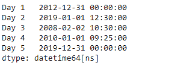
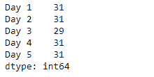
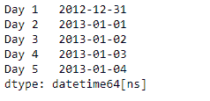
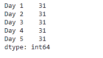

# 蟒蛇|熊猫系列. dt.days_in_month

> 原文:[https://www . geesforgeks . org/python-pandas-series-dt-days _ in _ month/](https://www.geeksforgeeks.org/python-pandas-series-dt-days_in_month/)

`Series.dt`可用于访问系列的值，如 datetimelike，并返回几个属性。熊猫 `**Series.dt.days_in_month**`属性返回给定系列对象在一个月中的天数。

> **语法:** Series.dt.days_in_month
> 
> **参数:**无
> 
> **返回:** numpy 数组

**示例#1:** 使用`Series.dt.days_in_month`属性在序列对象中查找给定日期当月的天数。

```
# importing pandas as pd
import pandas as pd

# Creating the Series
sr = pd.Series(['2012-12-31', '2019-1-1 12:30', '2008-02-2 10:30',
               '2010-1-1 09:25', '2019-12-31 00:00'])

# Creating the index
idx = ['Day 1', 'Day 2', 'Day 3', 'Day 4', 'Day 5']

# set the index
sr.index = idx

# Convert the underlying data to datetime 
sr = pd.to_datetime(sr)

# Print the series
print(sr)
```

**输出:**



现在我们将使用`Series.dt.days_in_month`属性来查找给定日期的月份天数。

```
# find the number of 
# days in the month
result = sr.dt.days_in_month

# print the result
print(result)
```

**输出:**



从输出中我们可以看到，`Series.dt.days_in_month`属性已经成功访问并返回了给定日期的月天数。

**示例#2 :** 使用`Series.dt.days_in_month`属性在序列对象中查找给定日期当月的天数。

```
# importing pandas as pd
import pandas as pd

# Creating the Series
sr = pd.Series(pd.date_range('2012-12-31 00:00', periods = 5, freq = 'D'))

# Creating the index
idx = ['Day 1', 'Day 2', 'Day 3', 'Day 4', 'Day 5']

# set the index
sr.index = idx

# Print the series
print(sr)
```

**输出:**



现在我们将使用`Series.dt.days_in_month`属性来查找给定日期的月份天数。

```
# find the number of 
# days in the month
result = sr.dt.days_in_month

# print the result
print(result)
```

**输出:**



从输出中我们可以看到，`Series.dt.days_in_month`属性已经成功访问并返回了给定日期的月天数。