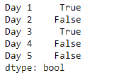
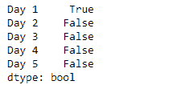

# 蟒蛇|熊猫系列. dt.is_leap_year

> 原文:[https://www . geesforgeks . org/python-pandas-series-dt-is _ leap _ year/](https://www.geeksforgeeks.org/python-pandas-series-dt-is_leap_year/)

`Series.dt`可用于访问系列的值，如 datetimelike，并返回几个属性。如果日期属于闰年，熊猫 `**Series.dt.is_leap_year**`属性返回一个布尔指示符。

> **语法:** Series.dt.is_leap_year
> 
> **参数:**无
> 
> **返回:** numpy 数组

**示例#1:** 使用`Series.dt.is_leap_year`属性检查给定序列对象的基础数据中的日期是否属于闰年。

```
# importing pandas as pd
import pandas as pd

# Creating the Series
sr = pd.Series(['2012-12-31', '2019-1-1 12:30', '2008-02-2 10:30',
               '2010-1-1 09:25', '2019-12-31 00:00'])

# Creating the index
idx = ['Day 1', 'Day 2', 'Day 3', 'Day 4', 'Day 5']

# set the index
sr.index = idx

# Convert the underlying data to datetime 
sr = pd.to_datetime(sr)

# Print the series
print(sr)
```

**输出:**


现在我们将使用`Series.dt.is_leap_year`属性来检查给定序列对象中的日期是否属于闰年。

```
# check if dates given
# belongs to a leap year.
result = sr.dt.is_leap_year

# print the result
print(result)
```

**输出:**



我们可以在输出中看到，`Series.dt.is_leap_year`属性已经成功访问并返回了布尔值，指示给定序列对象中的日期是否属于闰年。

**示例 2 :** 使用`Series.dt.is_leap_year`属性检查给定序列对象的基础数据中的日期是否属于闰年。

```
# importing pandas as pd
import pandas as pd

# Creating the Series
sr = pd.Series(pd.date_range('2012-12-31 00:00', periods = 5, freq = 'D'))

# Creating the index
idx = ['Day 1', 'Day 2', 'Day 3', 'Day 4', 'Day 5']

# set the index
sr.index = idx

# Print the series
print(sr)
```

**输出:**


现在我们将使用`Series.dt.is_leap_year`属性来检查给定序列对象中的日期是否属于闰年。

```
# check if dates given
# belongs to a leap year.
result = sr.dt.is_leap_year

# print the result
print(result)
```

**输出:**



我们可以在输出中看到，`Series.dt.is_leap_year`属性已经成功访问并返回了布尔值，指示给定序列对象中的日期是否属于闰年。