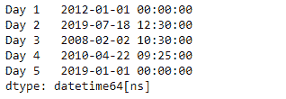
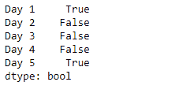
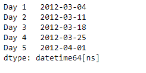
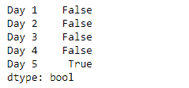

# Python | Pandas series . dt . is _ month _ start

> 原文:[https://www . geesforgeks . org/python-pandas-series-dt-is _ month _ start/](https://www.geeksforgeeks.org/python-pandas-series-dt-is_month_start/)

`Series.dt`可用于访问系列的值，如 datetimelike，并返回几个属性。熊猫 `**Series.dt.is_month_start**`属性返回一个布尔值，指示日期是否是一个月的第一天。

> **语法:** Series.dt.is_month_start
> 
> **参数:**无
> 
> **返回:** numpy 数组

**示例#1:** 使用`Series.dt.is_month_start`属性检查给定序列对象的基础数据中的日期是否是月初。

```py
# importing pandas as pd
import pandas as pd

# Creating the Series
sr = pd.Series(['2012-1-1', '2019-7-18 12:30', '2008-02-2 10:30',
               '2010-4-22 09:25', '2019-1-1 00:00'])

# Creating the index
idx = ['Day 1', 'Day 2', 'Day 3', 'Day 4', 'Day 5']

# set the index
sr.index = idx

# Convert the underlying data to datetime 
sr = pd.to_datetime(sr)

# Print the series
print(sr)
```

**输出:**


现在我们将使用`Series.dt.is_month_start`属性来检查给定序列对象中的日期是否是月初。

```py
# check if dates are the start
# of the month or not
result = sr.dt.is_month_start

# print the result
print(result)
```

**输出:**


正如我们在输出中看到的那样，`Series.dt.is_month_start`属性已经成功访问并返回了指示日期是否是月初的布尔值。

**示例 2 :** 使用`Series.dt.is_month_start`属性检查给定序列对象的基础数据中的日期是否是月初。

```py
# importing pandas as pd
import pandas as pd

# Creating the Series
sr = pd.Series(pd.date_range('2012-3-1 00:00',
                     periods = 5, freq = 'W'))

# Creating the index
idx = ['Day 1', 'Day 2', 'Day 3', 'Day 4', 'Day 5']

# set the index
sr.index = idx

# Print the series
print(sr)
```

**输出:**


现在我们将使用`Series.dt.is_month_start`属性来检查给定序列对象中的日期是否是月初。

```py
# check if dates are the start
# of the month or not
result = sr.dt.is_month_start

# print the result
print(result)
```

**输出:**

正如我们在输出中看到的，`Series.dt.is_month_start`属性已经成功访问并返回了指示日期是否是月初的布尔值。