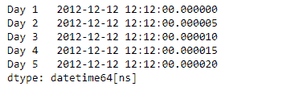
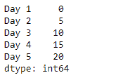
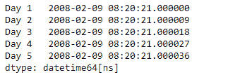
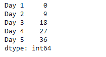

# 蟒蛇|熊猫系列. dt .微秒

> 原文:[https://www . geesforgeks . org/python-pandas-series-dt-微秒/](https://www.geeksforgeeks.org/python-pandas-series-dt-microsecond/)

`Series.dt`可用于访问系列的值，如 datetimelike，并返回几个属性。Pandas `**Series.dt.microsecond**`属性返回一个 numpy 数组，该数组包含给定序列对象的基础数据中日期时间的微秒。

> **语法:** Series.dt .微秒
> 
> **参数:**无
> 
> **返回:** numpy 数组

**示例#1:** 使用`Series.dt.microsecond`属性返回给定 Series 对象的基础数据中日期时间的微秒。

```py
# importing pandas as pd
import pandas as pd

# Creating the Series
sr = pd.Series(pd.date_range('2012-12-12 12:12',
                      periods = 5, freq = '5U'))

# Creating the index
idx = ['Day 1', 'Day 2', 'Day 3', 'Day 4', 'Day 5']

# set the index
sr.index = idx

# Print the series
print(sr)
```

**输出:**


现在我们将使用`Series.dt.microsecond`属性返回给定 Series 对象的基础数据中日期时间的微秒。

```py
# return the microsecond
result = sr.dt.microsecond

# print the result
print(result)
```

**输出:**

正如我们在输出中看到的，`Series.dt.microsecond`属性已经成功访问并返回了给定序列对象的底层数据中的日期时间的微秒。

**示例 2 :** 使用`Series.dt.microsecond`属性返回给定 Series 对象的基础数据中日期时间的微秒。

```py
# importing pandas as pd
import pandas as pd

# Creating the Series
sr = pd.Series(pd.date_range('2008-2-9 08:20:21',
                       periods = 5, freq = '9U'))

# Creating the index
idx = ['Day 1', 'Day 2', 'Day 3', 'Day 4', 'Day 5']

# set the index
sr.index = idx

# Print the series
print(sr)
```

**输出:**


现在我们将使用`Series.dt.microsecond`属性返回给定 Series 对象的基础数据中日期时间的微秒。

```py
# return the microsecond
result = sr.dt.microsecond

# print the result
print(result)
```

**输出:**

正如我们在输出中看到的，`Series.dt.microsecond`属性已经成功访问并返回了给定序列对象的底层数据中日期时间的微秒。