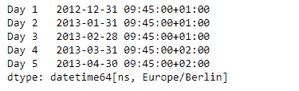
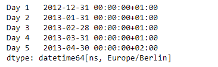
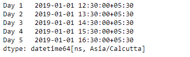
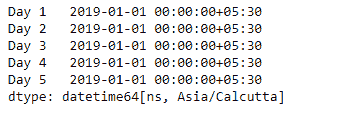

# Python | Pandas series . dt . normalize

> 原文:[https://www . geesforgeks . org/python-pandas-series-dt-normalize/](https://www.geeksforgeeks.org/python-pandas-series-dt-normalize/)

`Series.dt`可用于访问系列的值，如 datetimelike，并返回几个属性。熊猫 `**Series.dt.normalize()**`功能将时间转换为午夜。日期时间的时间部分转换为午夜，即 00:00:00。这在时间不重要的情况下很有用。长度不变。时区不受影响。

> **语法:** Series.dt.normalize(*args，**kwargs)
> 
> **参数:**无
> 
> **返回:**日期时间数组、日期时间索引或序列

**示例#1:** 使用`Series.dt.normalize()`功能将给定系列对象中的时间转换为午夜。

```
# importing pandas as pd
import pandas as pd

# Creating the Series
sr = pd.Series(pd.date_range('2012-12-31 09:45', periods = 5, freq = 'M',
                            tz = 'Europe / Berlin'))

# Creating the index
idx = ['Day 1', 'Day 2', 'Day 3', 'Day 4', 'Day 5']

# set the index
sr.index = idx

# Print the series
print(sr)
```

**输出:**



现在我们将使用`Series.dt.normalize()`功能将时间转换为午夜。

```
# convert to midnight
result = sr.dt.normalize()

# print the result
print(result)
```

**输出:**



正如我们在输出中看到的，`Series.dt.normalize()`函数已经成功地将给定序列对象中的时间转换为午夜。

**示例#1:** 使用`Series.dt.normalize()`功能将给定系列对象中的时间转换为午夜。

```
# importing pandas as pd
import pandas as pd

# Creating the Series
sr = pd.Series(pd.date_range('2019-1-1 12:30', periods = 5, freq = 'H',
                             tz = 'Asia / Calcutta'))

# Creating the index
idx = ['Day 1', 'Day 2', 'Day 3', 'Day 4', 'Day 5']

# set the index
sr.index = idx

# Print the series
print(sr)
```

**输出:**



现在我们将使用`Series.dt.normalize()`功能将时间转换为午夜。

```
# convert to midnight
result = sr.dt.normalize()

# print the result
print(result)
```

**输出:**



正如我们在输出中看到的，`Series.dt.normalize()`函数已经成功地将给定序列对象中的时间转换为午夜。