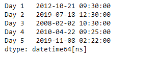
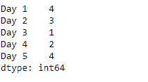
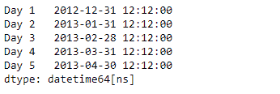
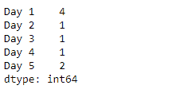

# 蟒蛇|熊猫系列. dt . quart

> 原文:[https://www . geesforgeks . org/python-pandas-series-dt-quarter/](https://www.geeksforgeeks.org/python-pandas-series-dt-quarter/)

`Series.dt`可用于访问系列的值，如 datetimelike，并返回几个属性。Pandas `**Series.dt.quarter**`属性返回给定序列对象中基于基础日期时间的数据中日期的四分之一。

> **语法:** Series.dt.quarter
> 
> **参数:**无
> 
> **返回:** numpy 数组

**示例#1:** 使用`Series.dt.quarter`属性返回给定序列对象的基础数据中日期的季度。

```
# importing pandas as pd
import pandas as pd

# Creating the Series
sr = pd.Series(['2012-10-21 09:30', '2019-7-18 12:30', '2008-02-2 10:30',
                '2010-4-22 09:25', '2019-11-8 02:22'])

# Creating the index
idx = ['Day 1', 'Day 2', 'Day 3', 'Day 4', 'Day 5']

# set the index
sr.index = idx

# Convert the underlying data to datetime 
sr = pd.to_datetime(sr)

# Print the series
print(sr)
```

**输出:**


现在，我们将使用`Series.dt.quarter`属性返回给定序列对象中基于日期时间的数据中日期的四分之一。

```
# return the quarter of the date
result = sr.dt.quarter

# print the result
print(result)
```

**输出:**

正如我们在输出中看到的，`Series.dt.quarter`属性已经成功访问并返回了给定序列对象的底层数据中日期的季度。

**示例 2 :** 使用`Series.dt.quarter`属性返回给定 Series 对象的基础数据中日期的季度。

```
# importing pandas as pd
import pandas as pd

# Creating the Series
sr = pd.Series(pd.date_range('2012-12-12 12:12', 
                       periods = 5, freq = 'M'))

# Creating the index
idx = ['Day 1', 'Day 2', 'Day 3', 'Day 4', 'Day 5']

# set the index
sr.index = idx

# Print the series
print(sr)
```

**输出:**


现在，我们将使用`Series.dt.quarter`属性返回给定序列对象中基于日期时间的数据中日期的四分之一。

```
# return the quarter of the date
result = sr.dt.quarter

# print the result
print(result)
```

**输出:**

正如我们在输出中看到的，`Series.dt.quarter`属性已经成功访问并返回了给定序列对象的底层数据中日期的季度。