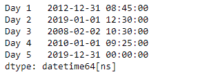
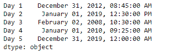
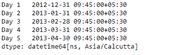

# Python |熊猫系列. dt.strftime

> 原文:[https://www . geesforgeks . org/python-pandas-series-dt-str time/](https://www.geeksforgeeks.org/python-pandas-series-dt-strftime/)

`Series.dt`可用于访问系列的值，如 datetimelike，并返回几个属性。熊猫 `**Series.dt.strftime()**`功能用于转换为指定日期格式的索引。该函数返回由 date_format 指定的格式化字符串的索引，它支持与 python 标准库相同的字符串格式。

> **语法:** Series.dt.strftime(*args，**kwargs)
> 
> **参数:**
> **date_format :** 日期格式字符串(如“%Y-%m-%d”)
> 
> **返回:**格式化字符串的索引

**示例#1:** 使用`Series.dt.strftime()`函数将给定序列对象中的日期转换为指定的日期格式。

```py
# importing pandas as pd
import pandas as pd

# Creating the Series
sr = pd.Series(['2012-12-31 08:45', '2019-1-1 12:30', '2008-02-2 10:30',
               '2010-1-1 09:25', '2019-12-31 00:00'])

# Creating the index
idx = ['Day 1', 'Day 2', 'Day 3', 'Day 4', 'Day 5']

# set the index
sr.index = idx

# Convert the underlying data to datetime 
sr = pd.to_datetime(sr)

# Print the series
print(sr)
```

**输出:**



现在我们将使用`Series.dt.strftime()`函数将给定序列对象中的日期转换为指定的格式。

```py
# convert to the given date format
result = sr.dt.strftime('% B % d, % Y, % r')

# print the result
print(result)
```

**输出:**



正如我们在输出中看到的那样，`Series.dt.strftime()`函数已经成功地将给定序列对象中的日期转换为指定的格式。

**示例 2 :** 使用`Series.dt.strftime()`函数将给定序列对象中的日期转换为指定的日期格式。

```py
# importing pandas as pd
import pandas as pd

# Creating the Series
sr = pd.Series(pd.date_range('2012-12-31 09:45', periods = 5, freq = 'M',
                            tz = 'Asia / Calcutta'))

# Creating the index
idx = ['Day 1', 'Day 2', 'Day 3', 'Day 4', 'Day 5']

# set the index
sr.index = idx

# Print the series
print(sr)
```

**输出:**



现在我们将使用`Series.dt.strftime()`函数将给定序列对象中的日期转换为指定的格式。

```py
# convert to the given date format
result = sr.dt.strftime('% d % m % Y, % r')

# print the result
print(result)
```

**输出:**


正如我们在输出中看到的那样，`Series.dt.strftime()`函数已经成功地将给定序列对象中的日期转换为指定的格式。