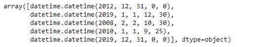
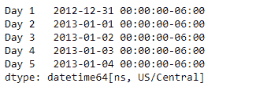
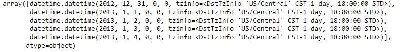

# Python | Pandas series . dt . to _ pydatetime

> 原文:[https://www . geesforgeks . org/python-pandas-series-dt-to _ pydatetime/](https://www.geeksforgeeks.org/python-pandas-series-dt-to_pydatetime/)

`Series.dt`可用于访问系列的值，如 datetimelike，并返回几个属性。Pandas `**Series.dt.to_pydatetime()**`函数将数据作为本机 Python 日期时间对象的数组返回。如果存在时区信息，将保留该信息。

> **语法:** Series.dt.to_pydatetime()
> 
> **参数:**无
> 
> **返回:** numpy.ndarray

**示例#1:** 使用`Series.dt.to_pydatetime()`函数将给定的序列对象作为本机 python datetime 对象的数组返回。

```py
# importing pandas as pd
import pandas as pd

# Creating the Series
sr = pd.Series(['2012-12-31', '2019-1-1 12:30', '2008-02-2 10:30',
               '2010-1-1 09:25', '2019-12-31 00:00'])

# Creating the index
idx = ['Day 1', 'Day 2', 'Day 3', 'Day 4', 'Day 5']

# set the index
sr.index = idx

# Convert the underlying data to datetime 
sr = pd.to_datetime(sr)

# Print the series
print(sr)
```

**输出:**


现在我们将使用`Series.dt.to_pydatetime()`函数将数据作为本机 Python datetime 对象的数组返回。

```py
# return the series data as a 
# native python datetime data
result = sr.dt.to_pydatetime() 

# print the result
print(result)
```

**输出:**



正如我们在输出中看到的那样，`Series.dt.to_pydatetime()`函数已经成功地将给定序列对象的底层数据作为本机 python datetime 数据的数组返回。

**示例#2 :** 使用`Series.dt.to_pydatetime()`函数将给定的序列对象作为本机 python datetime 对象的数组返回。

```py
# importing pandas as pd
import pandas as pd

# Creating the Series
sr = pd.Series(pd.date_range('2012-12-31 00:00', periods = 5, freq = 'D',
                            tz = 'US / Central'))

# Creating the index
idx = ['Day 1', 'Day 2', 'Day 3', 'Day 4', 'Day 5']

# set the index
sr.index = idx

# Print the series
print(sr)
```

**输出:**



现在我们将使用`Series.dt.to_pydatetime()`函数将数据作为本机 Python datetime 对象的数组返回。

```py
# return the series data as a 
# native python datetime data
result = sr.dt.to_pydatetime() 

# print the result
print(result)
```

**输出:**



正如我们在输出中看到的那样，`Series.dt.to_pydatetime()`函数已经成功地将给定序列对象的底层数据作为本机 python datetime 数据的数组返回。