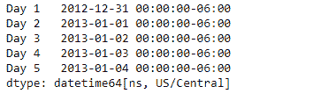
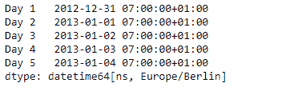
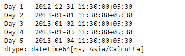

# Python | Pandas series . dt . tz _ convert

> 原文:[https://www . geesforgeks . org/python-pandas-series-dt-tz _ convert/](https://www.geeksforgeeks.org/python-pandas-series-dt-tz_convert/)

`Series.dt`可用于访问系列的值，如 datetimelike，并返回几个属性。Pandas `**Series.dt.tz_convert()**`函数将支持 tz 的日期时间数组/索引从一个时区转换到另一个时区。

> **语法:** Series.dt.tz_convert(*args，**kwargs)
> 
> **参数:**
> 
> **tz :** 要将时间戳转换为的时区。
> 
> **返回:**与自身类型相同

**示例#1:** 使用`Series.dt.tz_convert()`函数转换给定序列对象中时间戳的时区。

```py
# importing pandas as pd
import pandas as pd

# Creating the Series
sr = pd.Series(pd.date_range('2012-12-31 00:00', periods = 5, freq = 'D',
                            tz = 'US / Central'))

# Creating the index
idx = ['Day 1', 'Day 2', 'Day 3', 'Day 4', 'Day 5']

# set the index
sr.index = idx

# Print the series
print(sr)
```

**输出:**



现在我们将使用`Series.dt.tz_convert()`函数将给定系列对象中的时间戳转换为“欧洲/柏林”。

```py
# convert to 'Europe / Berlin'
result = sr.dt.tz_convert(tz = 'Europe / Berlin')

# print the result
print(result)
```

**输出:**



正如我们在输出中看到的那样，`Series.dt.tz_convert()`函数已经成功地将给定序列对象中时间戳的时区转换为目标时区。

**示例#2 :** 使用`Series.dt.tz_convert()`函数转换给定序列对象中时间戳的时区。

```py
# importing pandas as pd
import pandas as pd

# Creating the Series
sr = pd.Series(pd.date_range('2012-12-31 00:00', periods = 5, freq = 'D',
                            tz = 'US / Central'))

# Creating the index
idx = ['Day 1', 'Day 2', 'Day 3', 'Day 4', 'Day 5']

# set the index
sr.index = idx

# Print the series
print(sr)
```

**输出:**


现在我们将使用`Series.dt.tz_convert()`函数将给定序列对象中的时间戳转换为‘亚洲/加尔各答’。

```py
# convert to 'Asia / Calcutta'
result = sr.dt.tz_convert(tz = 'Asia / Calcutta')

# print the result
print(result)
```

**输出:**



正如我们在输出中看到的那样，`Series.dt.tz_convert()`函数已经成功地将给定序列对象中时间戳的时区转换为目标时区。