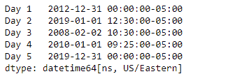
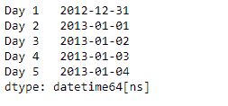
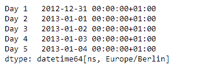

# Python | Pandas series . dt . tz _ localize

> 原文:[https://www . geesforgeks . org/python-pandas-series-dt-tz _ local/](https://www.geeksforgeeks.org/python-pandas-series-dt-tz_localize/)

`Series.dt`可用于访问系列的值，如 datetimelike，并返回几个属性。Pandas `**Series.dt.tz_localize()**`函数将支持 tz 的 Datetime 数组/索引本地化为支持 tz 的 Datetime 数组/索引。此方法采用一个时区(tz)简单的 Datetime 数组/索引对象，并使该时区具有感知能力。它不会将时间移到另一个时区。

> **语法:** Series.dt.tz_localize(*args，**kwargs)
> 
> **参数:**
> 
> **tz :** 要将时间戳转换为的时区。
> 
> **返回:**与自身类型相同

**示例#1:** 使用`Series.dt.tz_localize()`函数将系列中的 tz-naive 日期时间值本地化为 tz-aware。

```
# importing pandas as pd
import pandas as pd

# Creating the Series
sr = pd.Series(['2012-12-31', '2019-1-1 12:30', '2008-02-2 10:30',
               '2010-1-1 09:25', '2019-12-31 00:00'])

# Creating the index
idx = ['Day 1', 'Day 2', 'Day 3', 'Day 4', 'Day 5']

# set the index
sr.index = idx

# Convert the underlying data to datetime 
sr = pd.to_datetime(sr)

# Print the series
print(sr)
```

**输出:**


现在我们将使用`Series.dt.tz_localize()`函数将给定的天真系列本地化为‘美国/东方’。

```
# localize to 'US / Eastern'
result = sr.dt.tz_localize(tz = 'US / Eastern')

# print the result
print(result)
```

**输出:**



正如我们在输出中看到的那样，`Series.dt.tz_localize()`函数已经成功地将给定的 tz-naive datetime 序列本地化为 tz-aware。

**示例#2 :** 使用`Series.dt.tz_localize()`函数将给定的序列对象作为本机 python datetime 对象的数组返回。

```
# importing pandas as pd
import pandas as pd

# Creating the Series
sr = pd.Series(pd.date_range('2012-12-31 00:00', periods = 5, freq = 'D'))

# Creating the index
idx = ['Day 1', 'Day 2', 'Day 3', 'Day 4', 'Day 5']

# set the index
sr.index = idx

# Print the series
print(sr)
```

**输出:**



现在我们将使用`Series.dt.tz_localize()`函数将给定的天真系列本地化为“欧洲/柏林”。

```
# localize to 'Europe / Berlin'
result = sr.dt.tz_localize(tz = 'Europe / Berlin')

# print the result
print(result)
```

**输出:**



正如我们在输出中看到的那样，`Series.dt.tz_localize()`函数已经成功地将给定的 tz-naive datetime 序列本地化为 tz-aware。