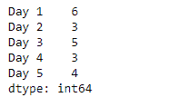
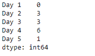

# Python | Pandas series . dt . weekday

> 原文:[https://www . geesforgeks . org/python-pandas-series-dt-weekday/](https://www.geeksforgeeks.org/python-pandas-series-dt-weekday/)

`Series.dt`可用于访问系列的值，如 datetimelike，并返回几个属性。熊猫 `**Series.dt.weekday**`属性返回星期几。假设一周从周一开始，用 0 表示，到周日结束，用 6 表示。

> **语法:** Series.dt.weekday
> 
> **参数:**无
> 
> **返回:** numpy 数组

**示例#1:** 使用`Series.dt.weekday`属性返回给定序列对象的基础数据中给定日期时间的星期几。

```
# importing pandas as pd
import pandas as pd

# Creating the Series
sr = pd.Series(['2012-10-21 09:30', '2019-7-18 12:30', '2008-02-2 10:30',
               '2010-4-22 09:25', '2019-11-8 02:22'])

# Creating the index
idx = ['Day 1', 'Day 2', 'Day 3', 'Day 4', 'Day 5']

# set the index
sr.index = idx

# Convert the underlying data to datetime 
sr = pd.to_datetime(sr)

# Print the series
print(sr)
```

**输出:**


现在我们将使用`Series.dt.weekday`属性返回给定序列对象的基础数据中给定日期时间的星期几。

```
# return the day of week
result = sr.dt.weekday

# print the result
print(result)
```

**输出:**

在输出中我们可以看到，`Series.dt.weekday`属性已经成功访问并返回了给定序列对象的底层数据中的星期几。

**示例#2 :** 使用`Series.dt.weekday`属性返回给定 Series 对象的基础数据中给定日期时间的星期几。

```
# importing pandas as pd
import pandas as pd

# Creating the Series
sr = pd.Series(pd.date_range('2012-12-12 12:12', periods = 5, freq = 'M'))

# Creating the index
idx = ['Day 1', 'Day 2', 'Day 3', 'Day 4', 'Day 5']

# set the index
sr.index = idx

# Print the series
print(sr)
```

**输出:**


现在我们将使用`Series.dt.weekday`属性返回给定序列对象的基础数据中给定日期时间的星期几。

```
# return the day of week
result = sr.dt.weekday

# print the result
print(result)
```

**输出:**

在输出中我们可以看到，`Series.dt.weekday`属性已经成功访问并返回了给定序列对象的底层数据中的星期几。