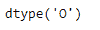
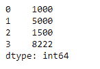

# 蟒蛇|熊猫系列. dtype

> 原文:[https://www.geeksforgeeks.org/python-pandas-series-dtype/](https://www.geeksforgeeks.org/python-pandas-series-dtype/)

Python 是进行数据分析的优秀语言，主要是因为以数据为中心的 python 包的奇妙生态系统。 ***【熊猫】*** 就是其中一个包，让导入和分析数据变得容易多了。

熊猫系列是带有轴标签的一维数组。标签不必是唯一的，但必须是可散列的类型。该对象支持基于整数和基于标签的索引，并提供了一系列方法来执行涉及索引的操作。

Pandas `**Series.dtype**`属性返回给定序列对象的基础数据的数据类型。

> **语法:** Series.dtype
> 
> **参数:**无
> 
> **返回:**数据类型

**示例#1:** 使用`Series.dtype`属性查找给定序列对象的基础数据的数据类型。

```
# importing pandas as pd
import pandas as pd

# Creating the Series
sr = pd.Series(['New York', 'Chicago', 'Toronto', 'Lisbon'])

# Creating the row axis labels
sr.index = ['City 1', 'City 2', 'City 3', 'City 4'] 

# Print the series
print(sr)
```

**输出:**


现在我们将使用`Series.dtype`属性来查找给定 Series 对象的数据类型。

```
# return the data type
sr.dtype
```

**输出:**



从输出中我们可以看到，`Series.dtype`属性已经返回了‘O’，表示底层数据的数据类型是对象类型。

**示例#2 :** 使用`Series.dtype`属性查找给定序列对象的基础数据的数据类型。

```
# importing pandas as pd
import pandas as pd

# Creating the Series
sr = pd.Series([1000, 5000, 1500, 8222])

# Print the series
print(sr)
```

**输出:**



现在我们将使用`Series.dtype`属性来查找给定 Series 对象的数据类型。

```
# return the data type
sr.dtype
```

**输出:**

正如我们在输出中看到的，`Series.dtype`属性返回了‘int 64’，表示底层数据的数据类型为`int64`类型。