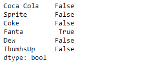
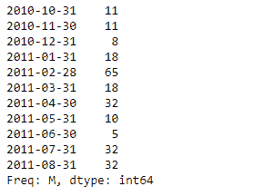
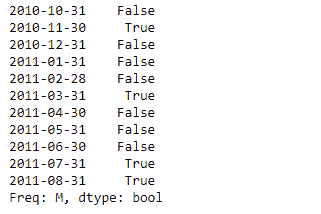

# 蟒蛇|熊猫系列.复制()

> 原文:[https://www . geesforgeks . org/python-pandas-series-replicated/](https://www.geeksforgeeks.org/python-pandas-series-duplicated/)

熊猫系列是带有轴标签的一维数组。标签不必是唯一的，但必须是可散列的类型。该对象支持整数索引和基于标签的索引，并提供了一系列方法来执行涉及索引的操作。

熊猫 `**Series.duplicated()**`功能表示重复的系列值。重复的值在结果序列中表示为真值。可以指示所有重复项，除了第一个重复项以外的所有重复项，或者除了最后一个重复项以外的所有重复项。

> **语法:**系列。重复(keep='first ')
> 
> **参数:**
> **保持:** { '第一'，'最后'，'假' }，默认'第一'
> 
> **回归:**熊猫.核心.系列.系列

**示例#1:** 使用`Series.duplicated()`函数查找给定序列对象中的重复值。

```
# importing pandas as pd
import pandas as pd

# Creating the Series
sr = pd.Series([80, 25, 3, 25, 24, 6])

# Create the Index
index_ = ['Coca Cola', 'Sprite', 'Coke', 'Fanta', 'Dew', 'ThumbsUp']

# set the index
sr.index = index_

# Print the series
print(sr)
```

**输出:**


现在我们将使用`Series.duplicated()`函数来查找给定序列对象的底层数据中的重复值。

```
# detect duplicates
result = sr.duplicated()

# Print the result
print(result)
```

**输出:**


正如我们在输出中看到的那样，`Series.duplicated()`函数已经成功检测到给定序列对象中的重复值。`False`表示对应的值是唯一的，而`True`表示对应的值是给定序列对象中的重复值。

**示例#2 :** 使用`Series.duplicated()`函数查找给定序列对象中的重复值。

```
# importing pandas as pd
import pandas as pd

# Creating the Series
sr = pd.Series([11, 11, 8, 18, 65, 18, 32, 10, 5, 32, 32])

# Create the Index
index_ = pd.date_range('2010-10-09', periods = 11, freq ='M')

# set the index
sr.index = index_

# Print the series
print(sr)
```

**输出:**


现在我们将使用`Series.duplicated()`函数来查找给定序列对象的底层数据中的重复值。

```
# detect duplicates
result = sr.duplicated()

# Print the result
print(result)
```

**输出:**

正如我们在输出中看到的，`Series.duplicated()`函数已经成功检测到给定序列对象中的重复值。`False`表示对应的值是唯一的，而`True`表示对应的值是给定序列对象中的重复值。