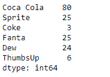
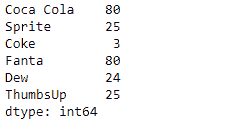
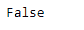
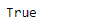

# Python | Pandas series . equals()

> 原文:[https://www.geeksforgeeks.org/python-pandas-series-equals/](https://www.geeksforgeeks.org/python-pandas-series-equals/)

熊猫系列是带有轴标签的一维数组。标签不必是唯一的，但必须是可散列的类型。该对象支持基于整数和基于标签的索引，并提供了一系列方法来执行涉及索引的操作。

熊猫 `**Series.equals()**`功能测试两个物体是否包含相同的元素。此功能允许将两个系列或数据帧相互比较，以查看它们是否具有相同的形状和元素。

> **语法:** Series.equals(其他)
> 
> **参数:**
> **其他:**要与第一个进行比较的其他系列或数据帧。
> 
> **如果两个对象中的所有元素都相同，则返回:** True，否则返回 False。

**示例#1:** 使用`Series.equals()`函数检查两个给定系列对象中的底层数据是否相同。

```
# importing pandas as pd
import pandas as pd

# Creating the first Series
sr1 = pd.Series([80, 25, 3, 25, 24, 6])

# Creating the second Series
sr2 = pd.Series([80, 25, 3, 80, 24, 25])

# Create the Index
index_ = ['Coca Cola', 'Sprite', 'Coke', 'Fanta', 'Dew', 'ThumbsUp']

# set the first series index
sr1.index = index_

# set the second series index
sr2.index = index_

# Print the first series
print(sr1)

# Print the second series
print(sr2)
```

**输出:**




现在我们将使用`Series.equals()`函数来检查两个给定系列对象中的底层数据是否相同。

```
# check for equality
result = sr1.equals(other = sr2)

# Print the result
print(result)
```

**输出:**


正如我们在输出中看到的，`Series.equals()`函数返回了`False`，表示两个给定系列对象中的元素不相同。

**示例 2:** 使用`Series.equals()`功能检查两个给定系列对象中的底层数据是否相同。

```
# importing pandas as pd
import pandas as pd

# Creating the first Series
sr1 = pd.Series([80, 25, 3, 25, 24, 6])

# Creating the second Series
sr2 = pd.Series([80, 25, 3, 25, 24, 6])

# Create the Index
index_ = ['Coca Cola', 'Sprite', 'Coke', 'Fanta', 'Dew', 'ThumbsUp']

# set the first series index
sr1.index = index_

# set the second series index
sr2.index = index_

# Print the first series
print(sr1)

# Print the second series
print(sr2)
```

**输出:**


现在我们将使用`Series.equals()`函数来检查两个给定系列对象中的底层数据是否相同。

```
# check for equality
result = sr1.equals(other = sr2)

# Print the result
print(result)
```

**输出:**

正如我们在输出中看到的，`Series.equals()`函数已经返回了`True`，表示两个给定系列对象中的元素是相同的。