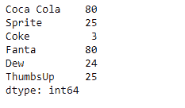
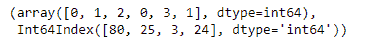

# Python | Pandas series . factorize()

> 原文:[https://www . geesforgeks . org/python-pandas-series-factorize/](https://www.geeksforgeeks.org/python-pandas-series-factorize/)

熊猫系列是带有轴标签的一维数组。标签不必是唯一的，但必须是可散列的类型。该对象支持基于整数和基于标签的索引，并提供了一系列方法来执行涉及索引的操作。

熊猫 `**Series.factorize()**`函数将对象编码为枚举类型或分类变量。当重要的是识别不同的值时，此方法对于获取数组的数字表示很有用。

> **语法:** Series.factorize(sort=False，na_sentinel=-1)
> 
> **参数:**
> **排序:**排序 uniques 和 shuffle 标签保持关系。
> **na_sentinel :** 值标记为“未找到”。
> 
> **返回:**
> **标签:**数组
> **唯一:**数组、索引或分类

**示例#1:** 使用`Series.factorize()`函数对给定序列对象的底层数据进行编码。

```py
# importing pandas as pd
import pandas as pd

# Creating the Series
sr = pd.Series(['New York', 'Chicago', 'Toronto', None, 'Rio'])

# Create the Index
sr.index = ['City 1', 'City 2', 'City 3', 'City 4', 'City 5'] 

# set the index
sr.index = index_

# Print the series
print(sr)
```

**输出:**


现在我们使用`Series.factorize()`函数对给定序列对象的底层数据进行编码。

```py
# encode the values
result = sr.factorize()

# Print the result
print(result)
```

**输出:**

正如我们在输出中看到的，`Series.factorize()`函数已经成功地对给定序列对象的底层数据进行了编码。请注意，丢失的值已被指定为代码-1。

**例 2 :** 使用`Series.factorize()`函数对给定序列对象的底层数据进行编码。

```py
# importing pandas as pd
import pandas as pd

# Creating the Series
sr = pd.Series([80, 25, 3, 80, 24, 25])

# Create the Index
index_ = ['Coca Cola', 'Sprite', 'Coke', 'Fanta', 'Dew', 'ThumbsUp']

# set the index
sr.index = index_

# Print the series
print(sr)
```

**输出:**


现在我们将使用`Series.factorize()`函数对给定序列对象的底层数据进行编码。

```py
# encode the values
result = sr.factorize()

# Print the result
print(result)
```

**输出:**

正如我们在输出中看到的，`Series.factorize()`函数已经成功地对给定序列对象的底层数据进行了编码。