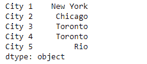
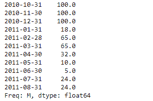

# 蟒蛇|熊猫系列. ffill()

> 原文:[https://www.geeksforgeeks.org/python-pandas-series-ffill/](https://www.geeksforgeeks.org/python-pandas-series-ffill/)

熊猫系列是带有轴标签的一维数组。标签不必是唯一的，但必须是可散列的类型。该对象支持基于整数和基于标签的索引，并提供了一系列方法来执行涉及索引的操作。

熊猫 `**Series.ffill()**`功能是向前填充的同义词。此函数用于使用正向填充方法填充给定序列对象中缺失的值。

> **语法:** Series.ffill(轴=无，在位=假，极限=无，向下转换=无)
> 
> **参数:**
> **轴:** {0 或‘指数’}
> **在位:**如果为真，填写到位。
> **限制:**如果指定了方法，这是向前/向后填充
> **向下转换的最大连续 NaN 值数:** dict，默认值为 None
> 
> **返回:**填充:系列

**示例#1:** 使用`Series.ffill()`函数填写给定序列对象中缺失的值。

```
# importing pandas as pd
import pandas as pd

# Creating the Series
sr = pd.Series(['New York', 'Chicago', 'Toronto', None, 'Rio'])

# Create the Index
sr.index = ['City 1', 'City 2', 'City 3', 'City 4', 'City 5'] 

# set the index
sr.index = index_

# Print the series
print(sr)
```

**输出:**


现在我们将使用`Series.ffill()`函数来填充给定序列对象中缺失的值。

```
# fill the missing values
result = sr.ffill()

# Print the result
print(result)
```

**输出:**

正如我们在输出中看到的，`Series.ffill()`函数已经成功地填充了给定序列对象中缺失的值。

**例 2 :** 使用`Series.ffill()`函数填写给定序列对象中缺失的值。

```
# importing pandas as pd
import pandas as pd

# Creating the Series
sr = pd.Series([100, None, None, 18, 65, None, 32, 10, 5, 24, None])

# Create the Index
index_ = pd.date_range('2010-10-09', periods = 11, freq ='M')

# set the index
sr.index = index_

# Print the series
print(sr)
```

**输出:**


现在我们将使用`Series.ffill()`函数来填充给定序列对象中缺失的值。

```
# fill the missing values
result = sr.ffill()

# Print the result
print(result)
```

**输出:**

正如我们在输出中看到的，`Series.ffill()`函数已经成功填充了给定序列对象中缺失的值。