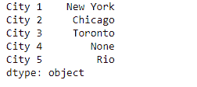
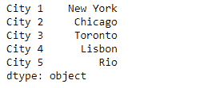
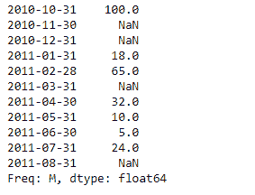
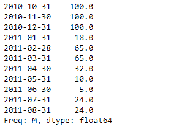

# 蟒蛇|熊猫系列. fillna()

> 原文:[https://www.geeksforgeeks.org/python-pandas-series-fillna/](https://www.geeksforgeeks.org/python-pandas-series-fillna/)

熊猫系列是带有轴标签的一维数组。标签不必是唯一的，但必须是可散列的类型。该对象支持基于整数和基于标签的索引，并提供了一系列方法来执行涉及索引的操作。

Pandas `**Series.fillna()**`功能用于使用指定的方法填充 NA/NaN 值。

> **语法:** Series.fillna(值=无，方法=无，轴=无，位置=假，限制=无，向下转换=无，**kwargs)
> 
> **参数:**
> **值:**用于填充孔的值
> **方法:**用于填充重新索引的 Series pad / ffill 中的孔的方法
> **轴:**{ 0 }或“index”}
> **位置:**如果为真，则填充到位。
> **限制:**如果指定了方法，这是向前/向后填充
> **向下转换:** dict 的最大连续 NaN 值，默认值为无
> 
> **返回:**填充:系列

**示例#1:** 使用`Series.fillna()`函数填写给定序列对象中缺失的值。使用字典传递对应于系列对象中不同索引标签的要填充的值。

```py
# importing pandas as pd
import pandas as pd

# Creating the Series
sr = pd.Series(['New York', 'Chicago', 'Toronto', None, 'Rio'])

# Create the Index
sr.index = ['City 1', 'City 2', 'City 3', 'City 4', 'City 5'] 

# set the index
sr.index = index_

# Print the series
print(sr)
```

**输出:**



现在我们将使用`Series.fillna()`函数来填充给定序列对象中缺失的值。

```py
# fill the values using dictionary
result = sr.fillna(value = {'City 4' : 'Lisbon', 'City 1' : 'Dublin'})

# Print the result
print(result)
```

**输出:**


正如我们在输出中看到的，`Series.fillna()`函数已经成功填充了给定序列对象中缺失的值。

**示例 2 :** 使用向前填充(ffill)方法，使用`Series.fillna()`函数填充给定序列对象中缺失的值。

```py
# importing pandas as pd
import pandas as pd

# Creating the Series
sr = pd.Series([100, None, None, 18, 65, None, 32, 10, 5, 24, None])

# Create the Index
index_ = pd.date_range('2010-10-09', periods = 11, freq ='M')

# set the index
sr.index = index_

# Print the series
print(sr)
```

**输出:**

现在我们将使用`Series.fillna()`函数来填充给定序列对象中缺失的值。我们将使用正向填充方法来填充缺失的值。

```py
# fill the values using forward fill method
result = sr.fillna(method = 'ffill')

# Print the result
print(result)
```

**输出:**


正如我们在输出中看到的，`Series.fillna()`函数已经成功填充了给定序列对象中缺失的值。