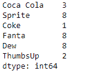
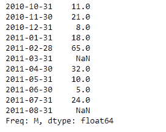
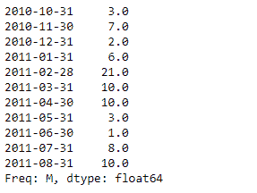

# Python | Pandas series . floor div()

> 原文:[https://www . geesforgeks . org/python-pandas-series-floor div/](https://www.geeksforgeeks.org/python-pandas-series-floordiv/)

熊猫系列是带有轴标签的一维数组。标签不必是唯一的，但必须是可散列的类型。该对象支持基于整数和基于标签的索引，并提供了一系列方法来执行涉及索引的操作。

熊猫 `**Series.floordiv()**`函数返回序列和其他元素的整数除法(二进制运算符 floordiv)。该操作相当于`series // other`，但支持用 fill_value 替换其中一个输入中缺失的数据

> **语法:** Series.floordiv(其他，级别=无，fill _ value =无，轴=0)
> 
> **参数:**
> **其他:**系列或标量值
> **fill_value :** 填充现有缺失(NaN)值，以及成功系列对齐所需的任何新元素，在计算前使用该值。
> **级别:**跨级别广播，在传递的多索引级别上匹配索引值
> 
> **返回:**结果:系列

**示例#1:** 使用`Series.floordiv()`函数对带有标量的系列对象执行楼层划分操作。

```py
# importing pandas as pd
import pandas as pd

# Creating the Series
sr = pd.Series([10, 25, 3, 25, 24, 6])

# Create the Index
index_ = ['Coca Cola', 'Sprite', 'Coke', 'Fanta', 'Dew', 'ThumbsUp']

# set the index
sr.index = index_

# Print the series
print(sr)
```

**输出:**


现在我们将使用`Series.floordiv()`函数对给定的带有标量的系列对象进行楼层划分。

```py
# perform floor division
result = sr.floordiv(other = 3)

# Print the result
print(result)
```

**输出:**

正如我们在输出中看到的，`Series.floordiv()`函数已经成功地返回了给定系列对象的带有标量的楼层划分结果。

**示例#2 :** 使用`Series.floordiv()`功能对带有标量的系列对象执行楼层划分操作。给定的序列对象包含一些缺失的值。

```py
# importing pandas as pd
import pandas as pd

# Creating the Series
sr = pd.Series([11, 21, 8, 18, 65, None, 32, 10, 5, 24, None])

# Create the Index
index_ = pd.date_range('2010-10-09', periods = 11, freq ='M')

# set the index
sr.index = index_

# Print the series
print(sr)
```

**输出:**



现在我们将使用`Series.floordiv()`函数对给定的带有标量的系列对象进行楼层划分。我们将在所有缺少值的地方填充 30。

```py
# perform floor division
result = sr.floordiv(other = 3, fill_value = 30)

# Print the result
print(result)
```

**输出:**



正如我们在输出中看到的，`Series.floordiv()`函数已经成功地返回了给定系列对象的带有标量的楼层划分结果。