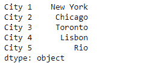
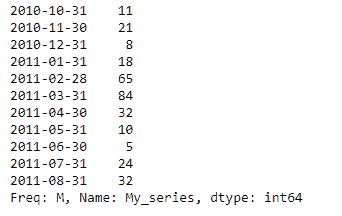

# Python | Pandas series . from _ array()

> 原文:[https://www . geesforgeks . org/python-pandas-series-from _ array/](https://www.geeksforgeeks.org/python-pandas-series-from_array/)

熊猫系列是带有轴标签的一维数组。标签不必是唯一的，但必须是可散列的类型。该对象支持基于整数和基于标签的索引，并提供了一系列方法来执行涉及索引的操作。

熊猫 `**Series.from_array()**`函数从一个数组中构造一个 Series 对象。我们也可以在创建时设置系列的名称和索引。

> **语法:** Series.from_array(arr，index=None，name=None，dtype=None，copy=False，fastpath=False)
> 
> **参数:**
> **arr :** 数组用于构建系列
> **索引:**设置系列的索引
> **名称:**设置系列的名称
> 
> **返回:**系列

**示例#1:** 使用`Series.from_array()`函数从数组中构造一个序列对象。

```
# importing pandas as pd
import pandas as pd

# Creating an array
array = ['New York', 'Chicago', 'Toronto', 'Lisbon', 'Rio']

# Create the Index
index_ = ['City 1', 'City 2', 'City 3', 'City 4', 'City 5'] 

# Creating the series
sr = pd.Series.from_array(arr = array, index = index_)

# Print the series
print(sr)
```

**输出:**


正如我们在输出中看到的，`Series.from_array()`函数已经成功地从一个数组中构造了一个序列对象。

**示例 2:** 使用`Series.from_array()`函数从数组中构造一个序列对象。还要设置系列的名称

```
# importing pandas as pd
import pandas as pd

# Creating an array
array = [11, 21, 8, 18, 65, 84, 32, 10, 5, 24, 32]

# Create the Index
index_ = pd.date_range('2010-10-09', periods = 11, freq ='M')

# Creating the series
# set the index
# set the name
sr = pd.Series.from_array(arr = array, index = index_, name = 'My_series')

# Print the series
print(sr)
```

**输出:**



正如我们在输出中看到的，`Series.from_array()`函数已经成功地从一个数组中构造了一个序列对象。我们还设定了系列的名称。