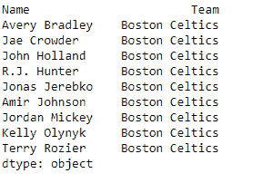
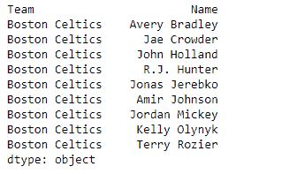

# Python | Pandas series . from _ CSV()

> 原文:[https://www . geesforgeks . org/python-pandas-series-from _ CSV/](https://www.geeksforgeeks.org/python-pandas-series-from_csv/)

熊猫系列是带有轴标签的一维数组。标签不必是唯一的，但必须是可散列的类型。该对象支持基于整数和基于标签的索引，并提供了一系列方法来执行涉及索引的操作。

Pandas `**Series.from_csv()**`功能用于将一个 csv 文件读入一个系列。最好将更强大的`pandas.read_csv()`用于大多数通用目的。

> **语法:** Series.from_csv(路径，sep= '，'，parse _ dates = True，header=None，index_col=0，编码=None，infer _ datetime _ format = False)
> 
> **参数:**
> **路径:**字符串文件路径或文件句柄/ StringIO
> **sep :** 字段分隔符
> **Parse _ date:**Parse date。不同于 read_table
> **标题的默认值:**用作标题的行(跳过前面的行)
> **index_col :** 用作索引的列
> **编码:**表示内容为非 ascii 时使用的编码的字符串
> **expert _ datetime _ format:**如果某列的 True 和 parse _ dates 为 True，则尝试根据第一个 datetime 字符串推断 datetime 格式
> 
> **返回:**系列

在这个例子中，我们使用了一个 CSV 文件。下载[点击这里](https://media.geeksforgeeks.org/wp-content/uploads/nba.csv)

**示例#1:** 使用`Series.from_csv()`功能将给定 CSV 文件中的数据读入熊猫系列。

```py
# importing pandas as pd
import pandas as pd

# Read the data into a series
sr = pd.Series.from_csv('nba.csv')

# Print the first 10 rows of series
print(sr.head(10))
```

**输出:**


正如我们在输出中看到的，`Series.from_csv()`函数已经成功地将 csv 文件读入了熊猫系列。

**示例#2 :** 使用`Series.from_csv()`功能将给定 CSV 文件中的数据读入熊猫系列。使用第一列作为系列对象的索引。

```py
# importing pandas as pd
import pandas as pd

# Read the data into a series
sr = pd.Series.from_csv('nba.csv', index_col = 1)

# Print the first 10 rows of series
print(sr.head(10))
```

**输出:**



正如我们在输出中看到的，`Series.from_csv()`函数已经成功地将 csv 文件读入了熊猫系列。