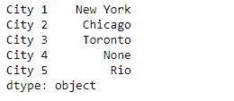
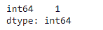

# Python | Pandas series . get _ dtype _ counts()

> 原文:[https://www . geesforgeks . org/python-pandas-series-get _ dtype _ counts/](https://www.geeksforgeeks.org/python-pandas-series-get_dtype_counts/)

熊猫系列是带有轴标签的一维数组。标签不必是唯一的，但必须是可散列的类型。该对象支持基于整数和基于标签的索引，并提供了一系列方法来执行涉及索引的操作。

熊猫 `**Series.get_dtype_counts()**`函数返回该对象中唯一数据类型的计数。

> **语法:** Series.get_values()
> 
> **参数:**无
> 
> **返回:**数据类型:系列

**示例#1:** 使用`Series.get_dtype_counts()`函数返回给定系列对象中唯一数据类型的计数。

```py
# importing pandas as pd
import pandas as pd

# Creating the Series
sr = pd.Series(['New York', 'Chicago', 'Toronto', None, 'Rio'])

# Create the Index
index_ = ['City 1', 'City 2', 'City 3', 'City 4', 'City 5'] 

# set the index
sr.index = index_

# Print the series
print(sr)
```

**输出:**


现在我们将使用`Series.get_dtype_counts()`函数返回给定序列对象中唯一 dytpe 的计数。

```py
# return the count of dtypes
result = sr.get_dtype_counts()

# Print the result
print(result)
```

**输出:**

正如我们在输出中看到的，`Series.get_dtype_counts()`函数已经返回了给定序列对象中 dtype 的计数。它已返回对象。

**示例 2 :** 使用`Series.get_dtype_counts()`函数返回给定序列对象中唯一数据类型的计数。

```py
# importing pandas as pd
import pandas as pd

# Creating the Series
sr = pd.Series([11, 21, 8, 18, 65, 84, 32, 10, 5, 24, 32])

# Create the Index
index_ = pd.date_range('2010-10-09', periods = 11, freq ='M')

# set the index
sr.index = index_

# Print the series
print(sr)
```

**输出:**


现在我们将使用`Series.get_dtype_counts()`函数返回给定序列对象中唯一 dytpe 的计数。

```py
# return the count of dtypes
result = sr.get_dtype_counts()

# Print the result
print(result)
```

**输出:**

正如我们在输出中看到的，`Series.get_dtype_counts()`函数已经返回了给定序列对象中的 dtype 的计数。它已经返回到 64 号。