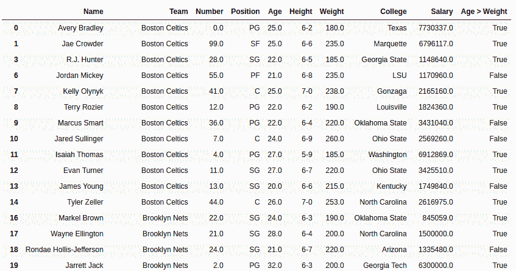

# 蟒蛇|熊猫系列. gt()

> 原文:[https://www.geeksforgeeks.org/python-pandas-series-gt/](https://www.geeksforgeeks.org/python-pandas-series-gt/)

Python 是进行数据分析的优秀语言，主要是因为以数据为中心的 Python 包的奇妙生态系统。 ***【熊猫】*** 就是其中一个包，让导入和分析数据变得容易多了。
Pandas **Series.gt()** 用于比较两个系列，并返回每个相应元素的布尔值。

> **语法:** Series.gt(other，level=None，fill_value=None，axis=0)
> **参数:**
> **other:** 要与
> **进行比较的其他 series level:**int 或 level 的名称在多级的情况下
> **fill_value:** 要替换为 NaN 的值
> **axis:** 0 或“index”按行和 1 或“列”应用方法
> **返回类型:**布尔系列

**注意:**结果是在对比主叫系列>其他系列的基础上返回的。
要下载以下示例中使用的数据集，请单击此处的[。](https://media.geeksforgeeks.org/wp-content/uploads/nba.csv)
在下面的例子中，使用的数据框包含了一些 NBA 球员的数据。任何操作前的数据框图像附在下面。


**示例 1:**
在此示例中，年龄列和体重列使用进行比较。gt()方法。由于权重列中的值与年龄列相比非常大，因此首先将值除以 10。在比较之前，使用删除空行。方法来避免错误。

## 蟒蛇 3

```py
# importing pandas module
import pandas as pd

# importing regex module
import re

# making data frame
data = pd.read_csv("https://media.geeksforgeeks.org/wp-content/uploads/nba.csv")

# removing null values to avoid errors
data.dropna(inplace = True)

# other series
other = data["Weight"]/10

# calling method and returning to new column
data["Age > Weight"]= data["Age"].gt(other)
```

**输出:**
如输出图像所示，只要“年龄”列中的值大于“体重/10”，新列就会为“真”。



**示例 2:** 处理 NaN 值
在此示例中，使用 pd 创建了两个系列。系列()。该序列也包含空值，因此将 5 传递给 fill_value 参数，用 5 替换空值。

## 蟒蛇 3

```py
# importing pandas module
import pandas as pd

# importing numpy module
import numpy as np

# creating series 1
series1 = pd.Series([24, 19, 2, 33, 49, 7, np.nan, 10, np.nan])

# creating series 2
series2 = pd.Series([16, np.nan, 2, 23, 5, 40, np.nan, 0, 9])

# setting null replacement value
na_replace = 5

# calling and storing result
result = series1.gt(series2, fill_value = na_replace)

# display
result
```

**输出:**
从输出中可以看出，NaN 值被替换为 5，替换后进行比较，使用新值进行比较。

```py
0     True
1     True
2    False
3     True
4     True
5    False
6    False
7     True
8    False
dtype: bool
```