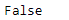
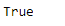

# 蟒蛇|熊猫系列. hasnans

> 原文:[https://www.geeksforgeeks.org/python-pandas-series-hasnans/](https://www.geeksforgeeks.org/python-pandas-series-hasnans/)

Python 是进行数据分析的优秀语言，主要是因为以数据为中心的 python 包的奇妙生态系统。 ***【熊猫】*** 就是其中一个包，让导入和分析数据变得容易多了。

熊猫系列是带有轴标签的一维数组。标签不必是唯一的，但必须是可散列的类型。该对象支持基于整数和基于标签的索引，并提供了一系列方法来执行涉及索引的操作。

熊猫 `**Series.hasnans**`属性返回一个布尔值。如果给定的序列对象中缺少值，则返回`True`，否则返回`False`。

> **语法:** Series.hasnans
> 
> **参数:**无
> 
> **返回:**布尔值

**示例#1:** 使用`Series.hasnans`属性检查给定的序列对象中是否有任何缺失值。

```py
# importing pandas as pd
import pandas as pd

# Creating the Series
sr = pd.Series(['New York', 'Chicago', 'Toronto', 'Lisbon'])

# Creating the row axis labels
sr.index = ['City 1', 'City 2', 'City 3', 'City 4'] 

# Print the series
print(sr)
```

**输出:**


现在我们将使用`Series.hasnans`属性来检查 sr 对象中缺少的值。

```py
# check for missing values.
sr.hasnans
```

**输出:**


正如我们在输出中看到的，`Series.hasnans`属性返回了`False`，表示给定序列对象中没有缺失值。

**示例 2 :** 使用`Series.hasnans`属性检查给定的序列对象中是否有任何缺失的值。

```py
# importing pandas as pd
import pandas as pd

# Creating the Series
sr = pd.Series([1000, 'Calgarry', 5000, None])

# Print the series
print(sr)
```

**输出:**


现在我们将使用`Series.hasnans`属性来检查 sr 对象中缺少的值。

```py
# check for missing values.
sr.hasnans
```

**输出:**

正如我们在输出中看到的，`Series.hasnans`属性已经返回了`True`，表示给定的序列对象中至少有一个缺失值。