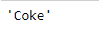

# Python |熊猫系列. idxmin()

> 原文:[https://www.geeksforgeeks.org/python-pandas-series-idxmin/](https://www.geeksforgeeks.org/python-pandas-series-idxmin/)

熊猫系列是带有轴标签的一维数组。标签不必是唯一的，但必须是可散列的类型。该对象支持基于整数和基于标签的索引，并提供了一系列方法来执行涉及索引的操作。

熊猫 `**Series.idxmin()**`功能返回最小值的行标签。如果多个值等于最小值，则返回具有该值的第一行标签。

> **语法:** Series.idxmin(axis=0，skipna=True，*args，**kwargs)
> 
> **参数:**
> **skipna :** 排除 NA/null 值。如果整个系列都是 NA，结果就是 NA。
> **轴:**用于与 DataFrame.idxmin 兼容。冗余用于系列上的应用。
> 
> **返回:** idxmin:最小值的索引。

**示例#1:** 使用`Series.idxmin()`函数在给定的序列对象中找到与最小值对应的索引标签。

```
# importing pandas as pd
import pandas as pd

# Creating the Series
sr = pd.Series([10, 25, 3, 25, 24, 6])

# Create the Index
index_ = ['Coca Cola', 'Sprite', 'Coke', 'Fanta', 'Dew', 'ThumbsUp']

# set the index
sr.index = index_

# Print the series
print(sr)
```

**输出:**


现在我们将使用`Series.idxmin()`函数来查找序列中最小值对应的索引标签。

```
# return index label of the 
# minimum value in the series
result = sr.idxmin()

# Print the result
print(result)
```

**输出:**

正如我们在输出中看到的，`Series.idxmin()`函数已经返回了给定序列对象中最小元素的索引标签。

**示例#2 :** 使用`Series.idxmin()`函数，在给定的序列对象中找到与最小值对应的索引标签。

```
# importing pandas as pd
import pandas as pd

# Creating the Series
sr = pd.Series([11, 21, 8, 18, 65, 84, 32, 10, 5, 24, 32])

# Create the Index
index_ = pd.date_range('2010-10-09', periods = 11, freq ='M')

# set the index
sr.index = index_

# Print the series
print(sr)
```

**输出:**


现在我们将使用`Series.idxmin()`函数来查找序列中最小值对应的索引标签。

```
# return index label of the 
# minimum value in the series
result = sr.idxmin()

# Print the result
print(result)
```

**输出:**

正如我们在输出中看到的，`Series.idxmin()`函数已经返回了给定序列对象中最小元素的索引标签。