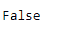
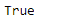

# Python |熊猫系列. is _ 单调

> 原文:[https://www . geesforgeks . org/python-pandas-series-is _ monotonic/](https://www.geeksforgeeks.org/python-pandas-series-is_monotonic/)

Python 是进行数据分析的优秀语言，主要是因为以数据为中心的 python 包的奇妙生态系统。 ***【熊猫】*** 就是其中一个包，让导入和分析数据变得容易多了。

熊猫系列是带有轴标签的一维*数组*。标签不必是唯一的，但必须是可散列的类型。该对象支持基于整数和基于标签的索引，并提供了一系列方法来执行涉及索引的操作。

熊猫 `**Series.is_monotonic**`属性返回一个布尔值。如果给定序列对象中的数据单调递增，则返回`True`，否则返回`False`。

> **语法:**series . is _ 单调
> 
> **参数:**无
> 
> **返回:**布尔值

**示例#1:** 使用`Series.is_monotonic`属性检查给定 Series 对象中的基础数据是否单调增加。

```
# importing pandas as pd
import pandas as pd

# Creating the Series
sr = pd.Series(['New York', 'Chicago', 'Toronto', 'Lisbon'])

# Creating the row axis labels
sr.index = ['City 1', 'City 2', 'City 3', 'City 4'] 

# Print the series
print(sr)
```

**输出:**


现在我们将使用`Series.is_monotonic`属性来检查给定 Series 对象中的底层数据是否单调递增。

```
# check if monotonically increasing
sr.is_monotonic
```

**输出:**



正如我们在输出中看到的那样，`Series.is_monotonic`属性返回了`False`，表明给定序列对象中的底层不是单调递增的。

**示例 2 :** 使用`Series.is_monotonic`属性检查给定 Series 对象中的基础数据是否单调增加。

```
# importing pandas as pd
import pandas as pd

# Creating the Series
sr = pd.Series(['1/1/2018', '2/1/2018', '3/1/2018', '4/1/2018'])

# Creating the row axis labels
sr.index = ['Day 1', 'Day 2', 'Day 3', 'Day 4']

# Print the series
print(sr)
```

**输出:**


现在我们将使用`Series.is_monotonic`属性来检查给定 Series 对象中的底层数据是否单调递增。

```
# check if monotonically increasing
sr.is_monotonic
```

**输出:**

正如我们在输出中可以看到的，`Series.is_monotonic`属性已经返回`True`表示给定序列对象中的底层是单调递增的。