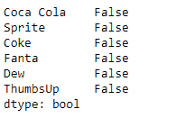
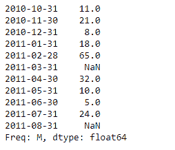
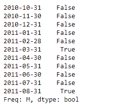

# 蟒蛇|熊猫系列. isna()

> 原文:[https://www.geeksforgeeks.org/python-pandas-series-isna/](https://www.geeksforgeeks.org/python-pandas-series-isna/)

熊猫系列是带有轴标签的一维数组。标签不必是唯一的，但必须是可散列的类型。该对象支持基于整数和基于标签的索引，并提供了一系列方法来执行涉及索引的操作。

熊猫 `**Series.isna()**`功能检测给定序列对象中缺失的值。它返回一个相同大小的布尔对象，指示值是否为“无”。缺失值被映射到`True`，非缺失值被映射到`False`。

> **语法:** Series.isna()
> 
> **参数:**无
> 
> **返回:**布尔值

**示例#1:** 使用`Series.isna()`功能检测给定序列对象中的缺失值。

```py
# importing pandas as pd
import pandas as pd

# Creating the Series
sr = pd.Series([10, 25, 3, 25, 24, 6])

# Create the Index
index_ = ['Coca Cola', 'Sprite', 'Coke', 'Fanta', 'Dew', 'ThumbsUp']

# set the index
sr.index = index_

# Print the series
print(sr)
```

**输出:**

现在我们将使用`Series.isna()`函数检测给定序列对象中所有缺失的值。

```py
# detect missing values
result = sr.isna()

# Print the result
print(result)
```

**输出:**

正如我们在输出中看到的，`Series.isna()`函数已经返回了一个包含布尔值的对象。所有值都已映射到`False`，因为给定序列对象中没有缺失值。

**示例 2 :** 使用`Series.isna()`功能检测给定序列对象中的缺失值。

```py
# importing pandas as pd
import pandas as pd

# Creating the Series
sr = pd.Series([11, 21, 8, 18, 65, None, 32, 10, 5, 24, None])

# Create the Index
index_ = pd.date_range('2010-10-09', periods = 11, freq ='M')

# set the index
sr.index = index_

# Print the series
print(sr)
```

**输出:**


现在我们将使用`Series.isna()`函数来检测给定序列对象中所有缺失的值。

```py
# detect missing values
result = sr.isna()

# Print the result
print(result)
```

**输出:**

正如我们在输出中看到的，`Series.isna()`函数返回了一个包含布尔值的对象。所有缺失的值都已映射到`True`。