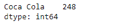
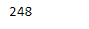
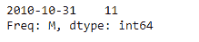
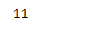

# 蟒蛇|熊猫系列. item()

> 原文:[https://www.geeksforgeeks.org/python-pandas-series-item/](https://www.geeksforgeeks.org/python-pandas-series-item/)

熊猫系列是带有轴标签的一维数组。标签不必是唯一的，但必须是可散列的类型。该对象支持基于整数和基于标签的索引，并提供了一系列方法来执行涉及索引的操作。

Pandas `**Series.item()**`函数以 python 标量的形式返回给定序列对象的底层数据的第一个元素。

**注意:**此函数只能将大小为 1 的数组转换为 Python 标量

> **语法:** Series.item()
> 
> **参数:**无
> 
> **返回:**标量

**示例#1:** 使用`Series.item()`函数以标量形式返回给定序列对象的第一个元素。

```
# importing pandas as pd
import pandas as pd

# Creating the Series
sr = pd.Series([248])

# Create the Index
index_ = ['Coca Cola']

# set the index
sr.index = index_

# Print the series
print(sr)
```

**输出:**



现在我们将使用`Series.item()`函数返回给定系列对象的第一个元素作为标量。

```
# return a scalar
result = sr.item()

# Print the result
print(result)
```

**输出:**


正如我们在输出中看到的，`Series.item()`函数已经成功返回了一个标量值。

**示例 2 :** 使用`Series.item()`函数迭代给定系列对象中的所有元素。

```
# importing pandas as pd
import pandas as pd

# Creating the Series
sr = pd.Series([11])

# Create the Index
index_ = pd.date_range('2010-10-09', periods = 1, freq ='M')

# set the index
sr.index = index_

# Print the series
print(sr)
```

**输出:**



现在我们将使用`Series.item()`函数返回给定系列对象的第一个元素作为标量。

```
# return a scalar
result = sr.item()

# Print the result
print(result)
```

**输出:**



正如我们在输出中看到的那样，`Series.item()`函数已经成功地返回了一个标量值。