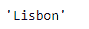
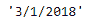

# 蟒蛇|熊猫系列. ix

> 原文:[https://www.geeksforgeeks.org/python-pandas-series-ix/](https://www.geeksforgeeks.org/python-pandas-series-ix/)

Python 是进行数据分析的优秀语言，主要是因为以数据为中心的 python 包的奇妙生态系统。 ***【熊猫】*** 就是其中一个包，让导入和分析数据变得容易多了。

熊猫系列是带有轴标签的一维数组。标签不必是唯一的，但必须是可散列的类型。该对象支持基于整数和基于标签的索引，并提供了一系列方法来执行涉及索引的操作。

Pandas `**Series.ix**`属性主要是基于标签位置的索引器，具有整数位置回退。它将标签作为输入，并返回与该标签对应的值。

> **语法:** Series.ix
> 
> **参数:**无
> 
> **返回:**值

**示例#1:** 使用`Series.ix`属性返回位于给定序列对象中指定标签的值。

```
# importing pandas as pd
import pandas as pd

# Creating the Series
sr = pd.Series(['New York', 'Chicago', 'Toronto', 'Lisbon'])

# Creating the row axis labels
sr.index = ['City 1', 'City 2', 'City 3', 'City 4'] 

# Print the series
print(sr)
```

**输出:**


现在我们将使用`Series.ix`属性返回对应于“城市 4”标签的值。

```
# return the value
sr.ix['City 4']
```

**输出:**


正如我们在输出中看到的，`Series.ix`属性返回了‘Lisbon’作为对应于给定 Series 对象中‘City 4’标签的值。

**示例#2 :** 使用`Series.ix`属性返回位于给定序列对象中指定标签的值。

```
# importing pandas as pd
import pandas as pd

# Creating the Series
sr = pd.Series(['1/1/2018', '2/1/2018', '3/1/2018', '4/1/2018'])

# Creating the row axis labels
sr.index = ['Day 1', 'Day 2', 'Day 3', 'Day 4']

# Print the series
print(sr)
```

**输出:**


现在我们将使用`Series.ix`属性返回对应于“第 3 天”标签的值。

```
# return the value
sr.ix['Day 3']
```

**输出:**

正如我们在输出中看到的，`Series.ix`属性已经返回了‘3/1/2018’作为给定 Series 对象中‘Day 3’标签对应的值。