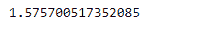

# 蟒蛇|熊猫系列. kurt()

> 原文:[https://www.geeksforgeeks.org/python-pandas-series-kurt/](https://www.geeksforgeeks.org/python-pandas-series-kurt/)

熊猫系列是带有轴标签的一维数组。标签不必是唯一的，但必须是可散列的类型。该对象支持基于整数和基于标签的索引，并提供了一系列方法来执行涉及索引的操作。

Pandas `**Series.kurt()**`函数使用费希尔峰度定义(正态峰度== 0.0)返回请求轴上的无偏峰度。结果用 N-1 归一化。

> **语法:**series . Kurt(axis =无，skipna =无，level =无，numeric _ only =无，**kwargs)
> 
> **参数:**
> **轴:**轴为要应用的功能。
> **skipna :** 计算结果时排除 NA/null 值。
> **级别:**如果轴是多索引(分层)，则沿着特定级别计数，折叠成标量。
> **numeric_only :** 只包括 float、int、boolean 列。
> ****kwargs :** 要传递给函数的附加关键字参数。
> 
> **返回:**库尔特:标量或级数(如果指定了级别)

**例#1:** 使用`Series.kurt()`函数求给定序列对象底层数据的峰度。

```
# importing pandas as pd
import pandas as pd

# Creating the Series
sr = pd.Series([10, 25, 3, 25, 24, 6])

# Create the Index
index_ = ['Coca Cola', 'Sprite', 'Coke', 'Fanta', 'Dew', 'ThumbsUp']

# set the index
sr.index = index_

# Print the series
print(sr)
```

**输出:**


现在我们将使用`Series.kurt()`函数来寻找给定序列对象的底层数据的峰度。

```
# return kurtosis
result = sr.kurt()

# Print the result
print(result)
```

**输出:**

正如我们在输出中看到的，`Series.kurt()`函数已经返回了给定序列对象的峰度。

**例 2 :** 使用`Series.kurt()`函数求给定序列对象底层数据的峰度。

```
# importing pandas as pd
import pandas as pd

# Creating the Series
sr = pd.Series([11, 21, 8, 18, 65, 84, 32, 10, 5, 24, 32])

# Create the Index
index_ = pd.date_range('2010-10-09', periods = 11, freq ='M')

# set the index
sr.index = index_

# Print the series
print(sr)
```

**输出:**


现在我们将使用`Series.kurt()`函数来寻找给定序列对象的底层数据的峰度。

```
# return kurtosis
result = sr.kurt()

# Print the result
print(result)
```

**输出:**


正如我们在输出中看到的，`Series.kurt()`函数返回了给定序列对象的峰度。