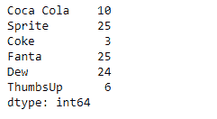
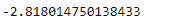
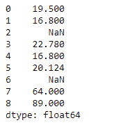
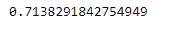

# 蟒蛇|熊猫系列.峰度()

> 原文:[https://www . geesforgeks . org/python-pandas-series-峰度/](https://www.geeksforgeeks.org/python-pandas-series-kurtosis/)

熊猫系列是带有轴标签的一维数组。标签不必是唯一的，但必须是可散列的类型。该对象支持基于整数和基于标签的索引，并提供了一系列方法来执行涉及索引的操作。

Pandas `**Series.kurtosis()**`函数使用费希尔峰度定义(正态峰度== 0.0)返回请求轴上的无偏峰度。最终结果用 N-1 归一化。

> **语法:**级数.峰度(轴=无，skipna =无，级别=无，numeric _ only =无，**kwargs)
> 
> **参数:**
> **轴:**轴为要应用的功能。
> **skipna :** 计算结果时排除 NA/null 值。
> **级别:**如果轴是多索引(分层)，则沿着特定级别计数，折叠成标量。
> **numeric_only :** 只包括 float、int、boolean 列。
> ****kwargs :** 要传递给函数的附加关键字参数。
> 
> **返回:**库尔特:标量或级数(如果指定了级别)

**示例#1:** 使用`Series.kurtosis()`函数查找给定序列对象中底层数据的峰度。

```py
# importing pandas as pd
import pandas as pd

# Creating the Series
sr = pd.Series([10, 25, 3, 25, 24, 6])

# Create the Index
index_ = ['Coca Cola', 'Sprite', 'Coke', 'Fanta', 'Dew', 'ThumbsUp']

# set the index
sr.index = index_

# Print the series
print(sr)
```

**输出:**


现在我们将使用`Series.kurtosis()`函数来寻找给定序列对象中底层数据的峰度。

```py
# return the kurtosis
result = sr.kurtosis()

# Print the result
print(result)
```

**输出:**


正如我们在输出中看到的，`Series.kurtosis()`函数返回了给定序列对象的峰度。

**示例#2 :** 使用`Series.kurtosis()`函数查找给定序列对象中底层数据的峰度。给定的序列对象包含一些缺失的值。

```py
# importing pandas as pd
import pandas as pd

# Creating the Series
sr = pd.Series([19.5, 16.8, None, 22.78, 16.8, 20.124, None, 64, 89])

# Print the series
print(sr)
```

**输出:**



现在我们将使用`Series.kurtosis()`函数来寻找给定序列对象中底层数据的峰度。

```py
# return the kurtosis
# skip the missing values
result = sr.kurtosis(skipna = True)

# Print the result
print(result)
```

**输出:**

正如我们在输出中看到的，`Series.kurtosis()`函数已经返回了给定序列对象的峰度。