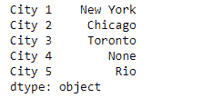
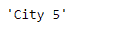
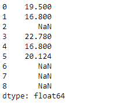
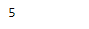

# Python | Pandas series . last _ valid _ index()

> 原文:[https://www . geesforgeks . org/python-pandas-series-last _ valid _ index/](https://www.geeksforgeeks.org/python-pandas-series-last_valid_index/)

熊猫系列是带有轴标签的一维数组。标签不必是唯一的，但必须是可散列的类型。该对象支持基于整数和基于标签的索引，并提供了一系列方法来执行涉及索引的操作。

Pandas `**Series.last_valid_index()**`函数返回给定序列对象中最后一个非 NA/null 值的索引。

> **语法:** Series.last_valid_index()
> 
> **参数:**无
> 
> **返回:**标量

**示例#1:** 使用`Series.last_valid_index()`函数返回给定序列对象的最后一个有效索引。

```
# importing pandas as pd
import pandas as pd

# Creating the Series
sr = pd.Series(['New York', 'Chicago', 'Toronto', None, 'Rio'])

# Create the Index
index_ = ['City 1', 'City 2', 'City 3', 'City 4', 'City 5'] 

# set the index
sr.index = index_

# Print the series
print(sr)
```

**输出:**



现在我们将使用`Series.last_valid_index()`函数返回给定序列对象的最后一个有效索引。

```
# return the last valid index
result = sr.last_valid_index()

# Print the result
print(result)
```

**输出:**


正如我们在输出中看到的，`Series.last_valid_index()`函数返回了给定序列对象中的最后一个有效索引。

**例 2:** 使用`Series.last_valid_index()`函数返回给定序列对象的最后一个有效索引。

```
# importing pandas as pd
import pandas as pd

# Creating the Series
sr = pd.Series([19.5, 16.8, None, 22.78, 16.8, 20.124, None, None, None])

# Print the series
print(sr)
```

**输出:**



现在我们将使用`Series.last_valid_index()`函数返回给定序列对象的最后一个有效索引。

```
# return the last valid index
result = sr.last_valid_index()

# Print the result
print(result)
```

**输出:**

正如我们在输出中看到的，`Series.last_valid_index()`函数已经返回了给定序列对象中的最后一个有效索引。