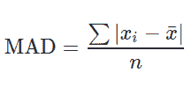

# Python | Pandas Series.mad()计算一个系列的平均绝对偏差

> 原文:[https://www . geeksforgeeks . org/python-pandas-series-mad-to-compute-mean-绝对偏差系列/](https://www.geeksforgeeks.org/python-pandas-series-mad-to-calculate-mean-absolute-deviation-of-a-series/)

熊猫提供了一种计算平均绝对偏差非常容易的方法。MAD 定义为每个值和平均值之间的平均距离。

用于计算 MAD 的公式为:



> **语法:** Series.mad(轴=无，skipna =无，级别=无)
> 
> **参数:**
> **轴:** 0 或“索引”用于行方向操作，1 或“列”用于列方向操作。
> **skipna:** 也包含 NaN 值如果为 False，即使包含单个空值，结果也将是 NaN。
> **级别:**定义多级系列情况下的级别名称或编号。
> 
> **返回类型:**浮点值

**示例#1:**
在本例中，使用熊猫从 Python 列表创建了一个系列。Series()方法。那个。mad()方法在具有所有默认参数的序列上调用。

```py
# importing pandas module 
import pandas as pd 

# importing numpy module 
import numpy as np 

# creating list
list =[5, 12, 1, 0, 4, 22, 15, 3, 9]

# creating series
series = pd.Series(list)

# calling .mad() method
result = series.mad()

# display
result
```

**输出:**

```py
5.876543209876543
```

**说明:**

> 系列平均值的计算平均值=(5+12+1+0+4+22+15+3+9)/9 = 7.8888
> 
> MAD = |(5-7.88)+(12-7.88)+(1-7.88)+(0-7.88)+(4-7.88)+(22-7.88)+(15-7.88)+(3-7.88)+(9-7.88))|/9.00
> 
> MAD =(2.88+4.12+6.88+7.88+3.88+14.12+7.12+4.88+1.12)/9.00
> 
> MAD = 5.8755