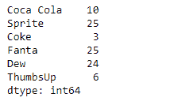
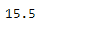
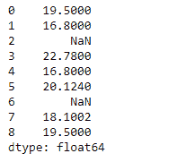
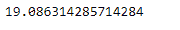

# 蟒蛇|熊猫系列. mean()

> 原文:[https://www.geeksforgeeks.org/python-pandas-series-mean/](https://www.geeksforgeeks.org/python-pandas-series-mean/)

熊猫系列是带有轴标签的一维数组。标签不必是唯一的，但必须是可散列的类型。该对象支持基于整数和基于标签的索引，并提供了一系列方法来执行涉及索引的操作。

熊猫 `**Series.mean()**`函数返回给定序列对象中基础数据的平均值。

> **语法:**序列.均值(轴=无，skipna =无，级别=无，numeric _ only =无，**kwargs)
> 
> **参数:**
> **轴:**轴为要应用的功能。
> **skipna :** 计算结果时排除 NA/null 值。
> **级别:**如果轴是多索引(分层)，则沿着特定级别计数，折叠成标量。
> **numeric_only :** 只包括 float、int、boolean 列。
> ****kwargs :** 要传递给函数的附加关键字参数。
> 
> **返回:**平均值:标量或级数(如果指定了级别)

**示例#1:** 使用`Series.mean()`函数找到给定序列对象中底层数据的平均值。

```py
# importing pandas as pd
import pandas as pd

# Creating the Series
sr = pd.Series([10, 25, 3, 25, 24, 6])

# Create the Index
index_ = ['Coca Cola', 'Sprite', 'Coke', 'Fanta', 'Dew', 'ThumbsUp']

# set the index
sr.index = index_

# Print the series
print(sr)
```

**输出:**


现在我们用`Series.mean()`函数求给定级数对象的平均值。

```py
# return the mean
result = sr.mean()

# Print the result
print(result)
```

**输出:**

正如我们在输出中看到的，`Series.mean()`函数已经成功返回了给定序列对象的平均值。

**例 2:** 用`Series.mean()`函数求给定序列对象中底层数据的均值。给定的序列对象也包含一些缺失的值。

```py
# importing pandas as pd
import pandas as pd

# Creating the Series
sr = pd.Series([19.5, 16.8, None, 22.78, 16.8, 20.124, None, 18.1002, 19.5])

# Print the series
print(sr)
```

**输出:**



现在我们用`Series.mean()`函数求给定级数对象的平均值。我们将在计算平均值时跳过所有缺失的值。

```py
# return the mean
# skip all the missing values
result = sr.mean(skipna = True)

# Print the result
print(result)
```

**输出:**

正如我们在输出中看到的，`Series.mean()`函数已经成功返回了给定序列对象的平均值。