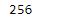
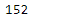

# Python | Pandas series . memory _ usage()

> 原文:[https://www . geesforgeks . org/python-pandas-series-memory _ usage/](https://www.geeksforgeeks.org/python-pandas-series-memory_usage/)

熊猫系列是带有轴标签的一维数组。标签不必是唯一的，但必须是可散列的类型。该对象支持基于整数和基于标签的索引，并提供了一系列方法来执行涉及索引的操作。

熊猫 `**Series.memory_usage()**`功能返回系列的内存使用情况。内存使用可以选择性地包括索引和对象数据类型元素的贡献。

> **语法:** Series.memory_usage(索引=True，深度=False)
> 
> **参数:**
> **索引:**指定是否包含 Series 索引的内存使用情况。
> **deep :** 如果为 True，则通过查询对象数据类型来深入检查数据，以获取系统级内存消耗，并将其包含在返回值中。
> 
> **返回:**消耗的内存字节。

**示例#1:** 使用`Series.memory_usage()`函数查找给定序列对象的内存使用情况。

```
# importing pandas as pd
import pandas as pd

# Creating the Series
sr = pd.Series([10, 25, 3, 25, 24, 6])

# Create the Index
index_ = ['Coca Cola', 'Sprite', 'Coke', 'Fanta', 'Dew', 'ThumbsUp']

# set the index
sr.index = index_

# Print the series
print(sr)
```

**输出:**


现在我们将使用`Series.memory_usage()`函数来查找给定系列对象的内存使用情况。

```
# return the memory usage
result = sr.memory_usage()

# Print the result
print(result)
```

**输出:**


正如我们在输出中看到的，`Series.memory_usage()`函数已经成功返回了给定序列对象的内存使用情况。

**例 2:** 使用`Series.memory_usage()`函数查找给定序列对象的内存使用情况。

```
# importing pandas as pd
import pandas as pd

# Creating the Series
sr = pd.Series([19.5, 16.8, None, 22.78, 16.8, 20.124, None, 18.1002, 19.5])

# Print the series
print(sr)
```

**输出:**


现在我们将使用`Series.memory_usage()`函数来查找给定系列对象的内存使用情况。

```
# return the memory usage
result = sr.memory_usage()

# Print the result
print(result)
```

**输出:**


正如我们在输出中看到的，`Series.memory_usage()`函数已经成功返回了给定序列对象的内存使用情况。