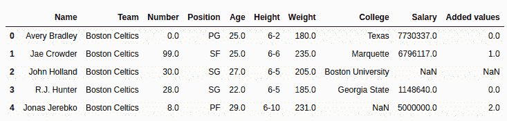
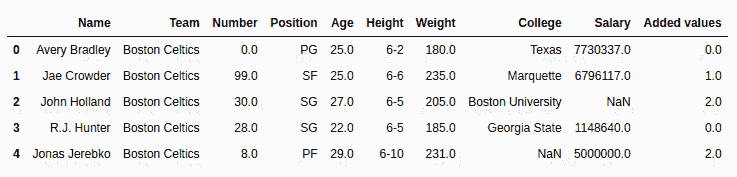

# Python | Pandas series . mod()

> 原文:[https://www.geeksforgeeks.org/python-pandas-series-mod/](https://www.geeksforgeeks.org/python-pandas-series-mod/)

Python 是进行数据分析的优秀语言，主要是因为以数据为中心的 Python 包的奇妙生态系统。 ***【熊猫】*** 就是其中一个包，让导入和分析数据变得容易多了。

Python **`Series.mod()`** 用来返回两个数除后的余数

> **语法:** Series.mod(其他，轴='columns '，级别=无，fill _ value =无)
> 
> **参数:**
> **其他:**其他系列或列表类型与调用者系列
> **相除并检查余数 fill_value:** 操作前系列/列表中要用 NaN 替换的值
> **级别:**多指标情况下级别的整数值
> 
> **返回类型:**带有 mod 值的调用者系列(调用者系列[i] %其他系列[i])

要下载下例使用的数据集，点击这里的[。](https://media.geeksforgeeks.org/wp-content/uploads/nba.csv)

在下面的例子中，使用的数据框包含了一些 NBA 球员的数据。任何操作前的数据框图像附在下面。


**示例#1:** 检查余数

在本例中，使用`head()`方法提取了 5 行数据帧。使用熊猫`Series()`方法从 Python 列表创建一个系列。在新的短数据帧上调用`mod()`方法，创建的列表作为其他参数传递。

```
# importing pandas module  
import pandas as pd 

# reading csv file from url  
data = pd.read_csv("https://media.geeksforgeeks.org/wp-content/uploads/nba.csv") 

# creating short data of 5 rows 
short_data = data.head() 

# creating list with 5 values 
list =[1, 2, 3, 4, 3] 

# finding remainder
# creating new column 
short_data["Remainder"]= short_data["Salary"].mod(list) 

# display 
short_data 
```

**输出:**

如输出图像所示，返回了调用者系列和其他系列中相同索引处的值除法后的余数。由于没有向 fill_value 参数传递任何内容，因此将按原样返回空值。


**示例 2:** 处理空值

就像在上面的例子中，同样的步骤被完成，但是这一次一个变量被创建并且一些随机的值被传递给它。该值随后作为 fill_value 参数传递给`mod()`方法。

```
# importing pandas module  
import pandas as pd 

# reading csv file from url  
data = pd.read_csv("https://media.geeksforgeeks.org/wp-content/uploads/nba.csv") 

# creating short data of 5 rows 
short_data = data.head() 

# creating list with 5 values 
list =[1, 2, 3, 4, 3] 

# replacing null value with any number
null_replacement = 21218

# finding remainder
# creating new column 
short_data["Remainder"]= short_data["Salary"].mod(list, fill_value = null_replacement) 

# display 
short_data 
```

**输出:**
如输出图像所示，空值被替换为 21218，所有操作都用该值完成。因此，在第三个位置返回了 21218 % 3 = 2，而不是 NaN。
