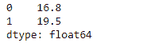

# 蟒蛇|熊猫系列. mode()

> 原文:[https://www.geeksforgeeks.org/python-pandas-series-mode/](https://www.geeksforgeeks.org/python-pandas-series-mode/)

熊猫系列是带有轴标签的一维数组。标签不必是唯一的，但必须是可散列的类型。该对象支持基于整数和基于标签的索引，并提供了一系列方法来执行涉及索引的操作。

熊猫 `**Series.mode()**`函数返回给定序列对象中底层数据的模式。即使只返回一个值，该函数也总是返回 Series。

> **语法:**串联模式(dropna =真)
> 
> **参数:**
> **dropna :** 不考虑 NaN/NaT 的计数
> 
> **返回:**模式:系列

**示例#1:** 使用`Series.mode()`功能找到给定系列对象的模式。

```py
# importing pandas as pd
import pandas as pd

# Creating the Series
sr = pd.Series([10, 25, 3, 25, 24, 6])

# Create the Index
index_ = ['Coca Cola', 'Sprite', 'Coke', 'Fanta', 'Dew', 'ThumbsUp']

# set the index
sr.index = index_

# Print the series
print(sr)
```

**输出:**


现在我们将使用`Series.mode()`函数找到给定系列对象的模式。

```py
# return the mode
result = sr.mode()

# Print the result
print(result)
```

**输出:**

我们可以在输出中看到，`Series.mode()`功能已经成功返回给定系列对象的模式。

**例 2:** 使用`Series.mode()`功能找到给定序列对象的模式。给定的序列对象包含一些缺失的值。

```py
# importing pandas as pd
import pandas as pd

# Creating the Series
sr = pd.Series([19.5, 16.8, None, 22.78, 16.8, 20.124, None, 18.1002, 19.5])

# Print the series
print(sr)
```

**输出:**


现在我们将使用`Series.mode()`函数找到给定系列对象的模式。

```py
# return the mode
result = sr.mode()

# Print the result
print(result)
```

**输出:**

在输出中我们可以看到，`Series.mode()`功能已经成功返回给定系列对象的模式。