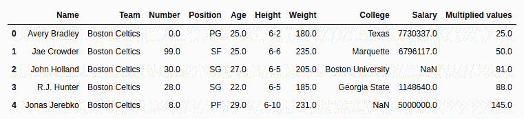
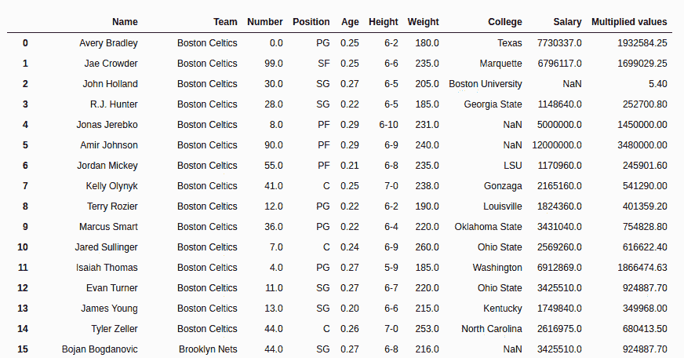

# 蟒蛇|熊猫系列. mul()

> 原文:[https://www.geeksforgeeks.org/python-pandas-series-mul/](https://www.geeksforgeeks.org/python-pandas-series-mul/)

Python 是进行数据分析的优秀语言，主要是因为以数据为中心的 Python 包的奇妙生态系统。 ***【熊猫】*** 就是其中一个包，让导入和分析数据变得容易多了。

Python **`Series.mul()`** 用于将数列相乘或列出与调用者数列长度相同的同类对象。

> **语法:** Series.mul(其他，级别=无，fill _ value =无，轴=0)
> 
> **参数:**
> **其他:**其他系列或列表类型要与调用者系列
> **相乘 fill_value:** 值要在相乘前用系列/列表中的 NaN 替换
> **级别:**多索引情况下级别的整数值
> 
> **返回类型:**带相乘值的调用者系列

要下载下例使用的数据集，点击这里的[。](https://media.geeksforgeeks.org/wp-content/uploads/nba.csv)
在下面的例子中，使用的数据框包含了一些 NBA 球员的数据。任何操作前的数据框图像附在下面。


**示例#1:** 列表与系列相乘

在本例中，前 5 行使用存储在新变量中。head()方法。之后，创建一个相同长度的列表，并使用乘以年龄列。mul()方法

```
# importing pandas module 
import pandas as pd

# reading csv file from url 
data = pd.read_csv("https://media.geeksforgeeks.org/wp-content/uploads/nba.csv")

# creating short data of 5 rows
short_data = data.head()

# creating list with 5 values
list =[1, 2, 3, 4, 5]

# multiplying list data
# creating new column
short_data["Multiplied values"]= short_data["Age"].mul(list)

# display
short_data
```

**输出:**
如输出图像所示，可以比较出相乘值列为(年龄)x(列表)的相乘值。


**示例#2:** 将系列与具有空值的系列相乘

在本例中，“工资”列与“年龄”列相乘。由于“工资”和“年龄”列中的值都很大，因此产品将以高值返回。因此，仅出于演示目的，在进行乘法之前，年龄列被除以 100。由于工资列也包含空值，默认情况下，无论乘以什么，它都会返回 NaN。在本例中，传递 20，用 20 替换空值。

```
# importing pandas module 
import pandas as pd

# reading csv file from url 
data = pd.read_csv("https://media.geeksforgeeks.org/wp-content/uploads/nba.csv")

# dividing age series
data["Age"]= data["Age"]/100

age = data["Age"]

# na replacement
na = 20

# Multiplying values
# storing to new column
data["Multiplied values"]= data["Salary"].mul(other = age, fill_value = na)

# display
data
```

**输出:**
如输出图像所示，在空值的情况下，乘法值列将年龄列乘以 20。
