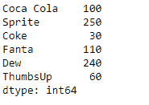
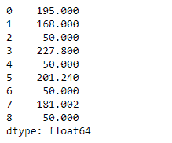

# 蟒蛇|熊猫系列.乘法()

> 原文:[https://www . geesforgeks . org/python-pandas-series-multiply/](https://www.geeksforgeeks.org/python-pandas-series-multiply/)

熊猫系列是带有轴标签的一维数组。标签不必是唯一的，但必须是可散列的类型。该对象支持基于整数和基于标签的索引，并提供了一系列方法来执行涉及索引的操作。

熊猫 `**Series.multiply()**`函数执行数列和其他元素的乘法。该操作相当于`series * other`，但支持用 fill_value 替换其中一个输入中缺失的数据。

> **语法:**系列。乘法(其他，级别=无，填充值=无，轴=0)
> 
> **参数:**
> **其他:**系列或标量值
> **填充 _ 值:**填充现有缺失(NaN)值
> **等级:**跨一级广播，
> 
> **返回:**结果:系列

**示例#1:** 使用`Series.multiply()`函数执行标量与给定序列对象的乘法运算。

```
# importing pandas as pd
import pandas as pd

# Creating the Series
sr = pd.Series([10, 25, 3, 11, 24, 6])

# Create the Index
index_ = ['Coca Cola', 'Sprite', 'Coke', 'Fanta', 'Dew', 'ThumbsUp']

# set the index
sr.index = index_

# Print the series
print(sr)
```

**输出:**


现在我们将使用`Series.multiply()`函数来执行标量与级数的乘法。

```
# multiply the given value with series
result = sr.multiply(other = 10)

# Print the result
print(result)
```

**输出:**

正如我们在输出中看到的，`Series.multiply()`函数返回了给定标量与级数对象相乘的结果。

**示例#2:** 使用`Series.multiply()`函数执行标量与给定序列对象的乘法运算。给定的序列对象包含一些缺失的值。

```
# importing pandas as pd
import pandas as pd

# Creating the Series
sr = pd.Series([19.5, 16.8, None, 22.78, None, 20.124, None, 18.1002, None])

# Print the series
print(sr)
```

**输出:**


现在我们将使用`Series.multiply()`函数来执行标量与级数的乘法。

```
# multiply the given value with series
# fill 5 at the place of all the missing values
result = sr.multiply(other = 10, fill_value = 5)

# Print the result
print(result)
```

**输出:**

正如我们在输出中看到的，`Series.multiply()`函数已经返回了给定标量与级数对象相乘的结果。