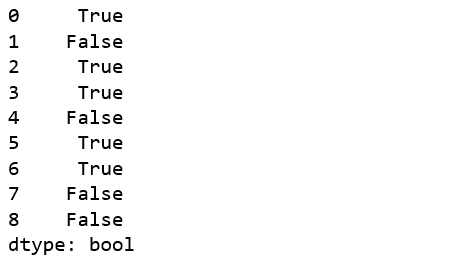

# 蟒蛇|熊猫系列. ne()

> 原文:[https://www.geeksforgeeks.org/python-pandas-series-ne/](https://www.geeksforgeeks.org/python-pandas-series-ne/)

Python 是进行数据分析的优秀语言，主要是因为以数据为中心的 Python 包的奇妙生态系统。 ***【熊猫】*** 就是其中一个包，让导入和分析数据变得容易多了。

熊猫 **`series.ne()`** 用来比较 Caller 系列和传递系列的每个元素。对于每个不等于传递序列中元素的元素，它返回真。

**注意:**结果是在对比来电者**系列的基础上返回的！=其他系列**。

> **语法:** Series.ne(其他，级别=无，fill _ value =无)
> 
> **参数:**
> **其他:**要与
> **级别进行比较的其他系列:** int 或多级别情况下的级别名称
> **fill_value:** 要替换为 NaN 的值
> 
> **返回类型:**布尔级数

**示例#1:** 处理空值

在本例中，使用 `pd.Series()`创建了两个系列。该系列在相同的索引中包含一些空值和一些相等的值。使用 **`.ne()`** 方法比较系列，并将 5 传递给 fill_value 参数，用 5 替换 NaN 值。

```py
# importing pandas module  
import pandas as pd  

# importing numpy module 
import numpy as np 

# creating series 1 
series1 = pd.Series([70, 5, 0, 225, 1, 16, np.nan, 10, np.nan]) 

# creating series 2 
series2 = pd.Series([27, np.nan, 2, 23, 1, 95, 53, 10, 5]) 

# NaN replacement
replace_nan = 5

# calling and returning to result variable
result = series1.ne(series2, fill_value = replace_nan)

# display 
result 
```

**输出:**
如输出所示，如果调用者序列中的值不等于传递序列中的值，则返回真。还可以看到，空值被 5 代替，使用该值进行比较。


**示例 2:** 使用字符串对象调用序列

在本例中，使用 pd 创建了两个系列。系列()。该系列也包含一些字符串值。如果是字符串，则用它们的 [ASCII 值](https://www.geeksforgeeks.org/ascii-in-python/)进行比较。

```py
# importing pandas module  
import pandas as pd  

# importing numpy module 
import numpy as np 

# creating series 1 
series1 = pd.Series(['Aaa', 0, 'cat', 43, 9, 'Dog', np.nan, 'x', np.nan]) 

# creating series 2 
series2 = pd.Series(['vaa', np.nan, 'Cat', 23, 5, 'Dog', 54, 'x', np.nan]) 

# NaN replacement
replace_nan = 14

# calling and returning to result variable
result = series1.ne(series2, fill_value = replace_nan)

# display 
result 
```

**输出:**
从输出中可以看出，对于字符串，比较是使用它们的 ASCII 值进行的。如果调用者序列中的字符串不等于传递序列中的字符串，则返回 True。
