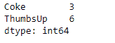
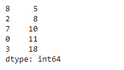

# 蟒蛇|熊猫系列. nsmalest()

> 原文:[https://www . geesforgeks . org/python-pandas-series-ns mallest/](https://www.geeksforgeeks.org/python-pandas-series-nsmallest/)

熊猫系列是带有轴标签的一维数组。标签不必是唯一的，但必须是可散列的类型。该对象支持基于整数和基于标签的索引，并提供了一系列方法来执行涉及索引的操作。

Pandas `**Series.nsmallest()**`函数返回给定序列对象中底层数据的 n 个最小元素。

> **语法:** Series.nsmallest(n=5，keep='first ')
> 
> **参数:**
> **n :** 返回这许多升序排序的值。
> **keep :** {'first '，' last '，' all'}，默认' first '
> 
> **返回:**系列

**示例#1:** 使用`Series.nsmallest()`函数返回给定序列对象的前 n 个最小元素。

```
# importing pandas as pd
import pandas as pd

# Creating the Series
sr = pd.Series([10, 25, 3, 11, 24, 6])

# Create the Index
index_ = ['Coca Cola', 'Sprite', 'Coke', 'Fanta', 'Dew', 'ThumbsUp']

# set the index
sr.index = index_

# Print the series
print(sr)
```

**输出:**


现在我们将使用`Series.nsmallest()`函数找到给定序列对象中的前 2 个最小值。

```
# return the first 2 of the smallest
# element
result = sr.nsmallest(n = 2)

# Print the result
print(result)
```

**输出:**



正如我们在输出中看到的那样，`Series.nsmallest()`函数已经成功地返回了给定序列对象中的前 2 个最小值。

**示例#2:** 使用`Series.nsmallest()`函数返回给定序列对象的前 n 个最小元素。

```
# importing pandas as pd
import pandas as pd

# Creating the Series
sr = pd.Series([11, 21, 8, 18, 65, 84, 32, 10, 5, 24, 32])

# Print the series
print(sr)
```

**输出:**


现在我们将使用`Series.nsmallest()`函数找到给定序列对象中的前 5 个最小值。

```
# return the first 5 of the smallest
# element
result = sr.nsmallest(n = 5)

# Print the result
print(result)
```

**输出:**



从输出中我们可以看到，`Series.nsmallest()`函数已经成功返回了给定序列对象中的前 5 个最小值。