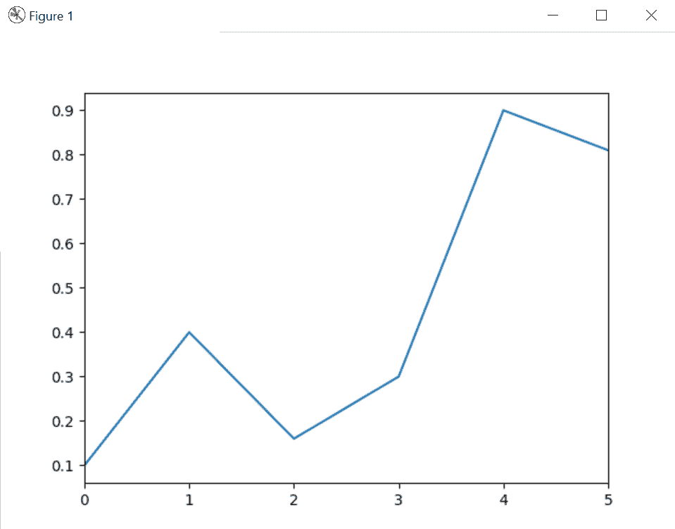
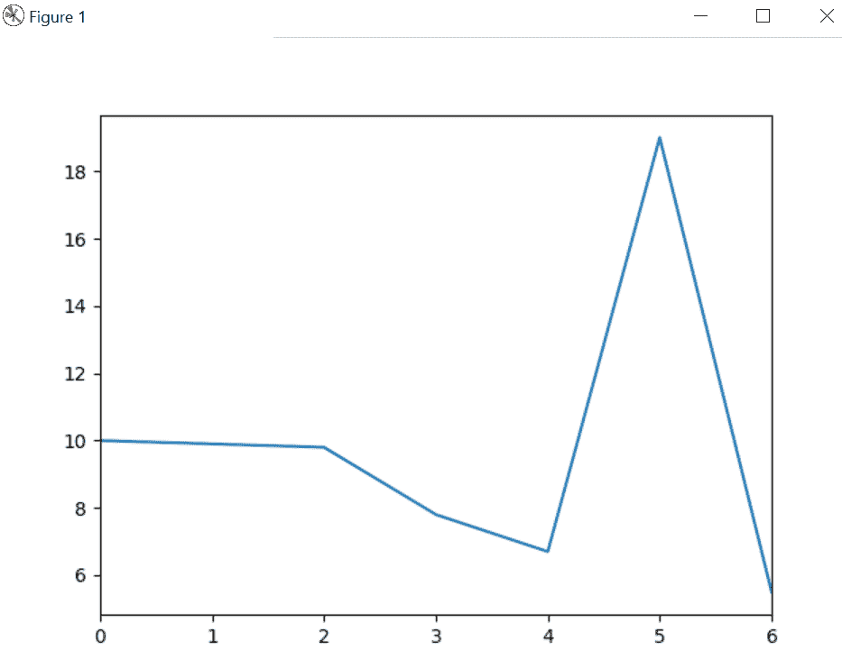

# Python | Pandas Series.plot()方法

> 原文:[https://www . geesforgeks . org/python-pandas-series-plot-method/](https://www.geeksforgeeks.org/python-pandas-series-plot-method/)

借助`**Series.plot()**`方法，我们可以利用`Series.plot()`方法得到熊猫系列的剧情。

> **语法:** `Series.plot()`
> **回归:**回归系列的剧情。

**Example #1 :**In this example we can see that by using `Series.plot()` method, we are able to get the plot of pandas series.

```
# import Series and matplotlib
import pandas as pd
import matplotlib.pyplot as plt

# using Series.plot() method
gfg = pd.Series([0.1, 0.4, 0.16, 0.3, 0.9, 0.81])

gfg.plot()
plt.show()
```

**输出:**



**例 2 :**

```
# import Series and matplotlib
import pandas as pd
import matplotlib.pyplot as plt

# using Series.plot() method
gfg = pd.Series([10, 9.9, 9.8, 7.8, 6.7, 19, 5.5])

gfg.plot()
plt.show()
```

**输出:**

