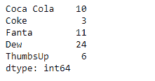
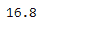
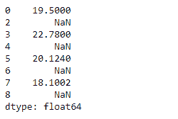

# 蟒蛇|熊猫系列. pop()

> 原文:[https://www.geeksforgeeks.org/python-pandas-series-pop/](https://www.geeksforgeeks.org/python-pandas-series-pop/)

熊猫系列是带有轴标签的一维数组。标签不必是唯一的，但必须是可散列的类型。该对象支持基于整数和基于标签的索引，并提供了一系列方法来执行涉及索引的操作。

熊猫 `**Series.pop()**`函数返回传递的索引标签对应的项目。它还从系列对象中删除项目。

> **语法:**系列. pop(项目)
> 
> **参数:**
> **项:** str
> 
> **返回:**弹出:系列

**示例#1:** 使用`Series.pop()`函数从给定的序列对象中弹出一个元素。

```py
# importing pandas as pd
import pandas as pd

# Creating the Series
sr = pd.Series([10, 25, 3, 11, 24, 6])

# Create the Index
index_ = ['Coca Cola', 'Sprite', 'Coke', 'Fanta', 'Dew', 'ThumbsUp']

# set the index
sr.index = index_

# Print the series
print(sr)
```

**输出:**


现在我们将使用`Series.pop()`函数弹出给定系列对象中“精灵”的条目。

```py
# pop the passed index label from
# series object
result = sr.pop(item = 'Sprite')

# Print the result
print(result)

# Series after popping 
print(sr)
```

**输出:**




正如我们在输出中看到的那样，`Series.pop()`函数已经成功地弹出了给定系列对象中传递标签的条目。

**示例 2 :** 使用`Series.pop()`函数从给定的序列对象中弹出一个元素。给定的序列对象中包含一些缺失的值。

```py
# importing pandas as pd
import pandas as pd

# Creating the Series
sr = pd.Series([19.5, 16.8, None, 22.78, None, 20.124, None, 18.1002, None])

# Print the series
print(sr)
```

**输出:**


现在我们将使用`Series.pop()`函数弹出给定 Series 对象中第一个索引标签对应的条目。

```py
# pop the passed index label from
# series object
result = sr.pop(item = 1)

# Print the result
print(result)

# Series after popping 
print(sr)
```

**输出:**





正如我们在输出中看到的那样，`Series.pop()`函数已经成功地弹出了给定系列对象中传递标签的条目。