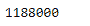
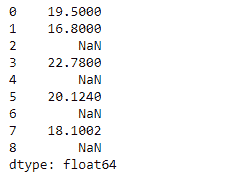
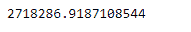

# 蟒蛇|熊猫系列.产品()

> 原文:[https://www.geeksforgeeks.org/python-pandas-series-product/](https://www.geeksforgeeks.org/python-pandas-series-product/)

熊猫系列是带有轴标签的一维数组。标签不必是唯一的，但必须是可散列的类型。该对象支持基于整数和基于标签的索引，并提供了一系列方法来执行涉及索引的操作。

Pandas `**Series.product()**`函数返回给定 Series 对象中底层数据的乘积。

> **语法:**series . product(axis =无，skipna =无，level =无，numeric _ only =无，min_count=0，**kwargs)
> 
> **参数:**
> **轴:**轴为要应用的功能。
> **skipna :** 计算结果时排除 NA/null 值。
> **级别:**如果轴是多索引(分层)，则沿着特定级别计数，折叠成标量。
> **numeric_only :** 只包括 float、int、boolean 列。如果没有，将尝试使用所有内容，然后只使用数字数据。不适用于系列。
> **min_count :** 执行操作所需的有效值数量。
> ****kwargs :** 要传递给函数的附加关键字参数。
> 
> **返回:**生产:标量或序列(如果指定了级别)

**示例#1:** 使用`Series.product()`函数在给定的 Series 对象中查找底层数据的乘积。

```
# importing pandas as pd
import pandas as pd

# Creating the Series
sr = pd.Series([10, 25, 3, 11, 24, 6])

# Create the Index
index_ = ['Coca Cola', 'Sprite', 'Coke', 'Fanta', 'Dew', 'ThumbsUp']

# set the index
sr.index = index_

# Print the series
print(sr)
```

**输出:**


现在我们将使用`Series.product()`函数来寻找给定系列对象中元素的乘积。

```
# return the product of all elements
result = sr.product()

# Print the result
print(result)
```

**输出:**



正如我们在输出中看到的那样，`Series.product()`函数已经成功地返回了给定序列对象中底层数据的乘积。

**示例#2 :** 使用`Series.product()`函数在给定的 Series 对象中查找底层数据的乘积。给定的序列对象中包含一些缺失的值。

```
# importing pandas as pd
import pandas as pd

# Creating the Series
sr = pd.Series([19.5, 16.8, None, 22.78, None, 20.124, None, 18.1002, None])

# Print the series
print(sr)
```

**输出:**



现在我们将使用`Series.product()`函数来寻找给定系列对象中元素的乘积。我们将跳过缺失的值。

```
# return the product of all elements
result = sr.product(skipna = True)

# Print the result
print(result)
```

**输出:**



正如我们在输出中看到的那样，`Series.product()`函数已经成功地返回了给定序列对象中底层数据的乘积。