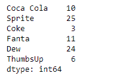
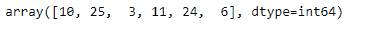
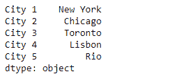
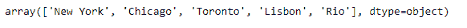

# 蟒蛇|熊猫系列. ravel()

> 原文:[https://www.geeksforgeeks.org/python-pandas-series-ravel/](https://www.geeksforgeeks.org/python-pandas-series-ravel/)

熊猫系列是带有轴标签的一维数组。标签不必是唯一的，但必须是可散列的类型。该对象支持基于整数和基于标签的索引，并提供了一系列方法来执行涉及索引的操作。

熊猫 `**Series.ravel()**`函数返回展平的底层数据作为数组。

> **语法:** Series.ravel(order='C ')
> 
> **参数:**顺序
> 
> **返回:**正常

**示例#1:** 使用`Series.ravel()`函数返回给定序列对象的元素作为数组。

```
# importing pandas as pd
import pandas as pd

# Creating the Series
sr = pd.Series([10, 25, 3, 11, 24, 6])

# Create the Index
index_ = ['Coca Cola', 'Sprite', 'Coke', 'Fanta', 'Dew', 'ThumbsUp']

# set the index
sr.index = index_

# Print the series
print(sr)
```

**输出:**



现在我们将使用`Series.ravel()`函数返回给定 Series 对象的底层数据作为一个数组。

```
# return an ndarray
result = sr.ravel()

# Print the result
print(result)
```

**输出:**



正如我们在输出中看到的那样，`Series.ravel()`函数返回了包含给定序列对象数据的数组。

**示例#2:** 使用`Series.ravel()`函数返回给定序列对象的元素作为数组。

```
# importing pandas as pd
import pandas as pd

# Creating the Series
sr = pd.Series(['New York', 'Chicago', 'Toronto', 'Lisbon', 'Rio'])

# Create the Index
index_ = ['City 1', 'City 2', 'City 3', 'City 4', 'City 5'] 

# set the index
sr.index = index_

# Print the series
print(sr)
```

**输出:**



现在我们将使用`Series.ravel()`函数返回给定 Series 对象的底层数据作为一个数组。

```
# return an ndarray
result = sr.ravel()

# Print the result
print(result)
```

**输出:**



正如我们在输出中看到的那样，`Series.ravel()`函数返回了包含给定序列对象数据的数组。