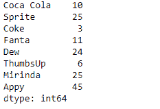
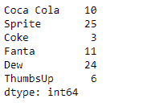
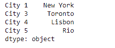
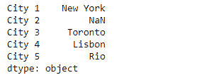

# Python | Pandas series . reindex _ like()

> 原文:[https://www . geesforgeks . org/python-pandas-series-rein dex _ like/](https://www.geeksforgeeks.org/python-pandas-series-reindex_like/)

熊猫系列是带有轴标签的一维数组。标签不必是唯一的，但必须是可散列的类型。该对象支持整数索引和基于标签的索引，并提供了一系列方法来执行涉及索引的操作。

熊猫 `**Series.reindex_like()**`函数返回一个具有匹配索引的对象作为其他对象。它使对象符合所有轴上的相同索引。

> **语法:** Series.reindex_like(other，方法=无，复制=真，限制=无，容差=无)
> 
> **参数:**
> **其他:**其行索引和列索引用于定义该对象的新索引。
> **方法:**用于填充重新索引的数据框中的孔的方法。
> **复制:**返回新对象，即使传递的索引相同。
> **限制:**为不精确匹配填充的连续标签的最大数量。
> **公差:**不精确匹配的原始标签和新标签之间的最大距离。
> 
> **返回:**序列或数据帧

**示例#1:** 使用`Series.reindex_like()`函数基于另一个对象重新索引给定的序列对象。

```
# importing pandas as pd
import pandas as pd

# Creating the first Series
sr1 = pd.Series([10, 25, 3, 11, 24, 6])

# Create the Index
index_ = ['Coca Cola', 'Sprite', 'Coke', 'Fanta', 'Dew', 'ThumbsUp']

# set the index
sr1.index = index_

# Print the series
print(sr1)

# Creating the second Series
sr2 = pd.Series([10, 25, 3, 11, 24, 6, 25, 45])

# Create the Index
index_ = ['Coca Cola', 'Sprite', 'Coke', 'Fanta',
            'Dew', 'ThumbsUp', 'Mirinda', 'Appy']

# set the index
sr2.index = index_

# Print the series
print(sr2)
```

**输出:**



现在我们将使用`Series.reindex_like()`函数基于 sr1 重新索引 sr2 系列对象。

```
# reindex sr2 using sr1
result = sr2.reindex_like(sr1)

# Print the result
print(result)
```

**输出:**


正如我们在输出中看到的，`Series.reindex_like()`函数已经成功地使用 sr1 对 sr2 对象进行了重新索引。额外标签的通知已被删除。

**示例#2 :** 使用`Series.reindex_like()`函数基于另一个对象重新索引给定的序列对象。

```
# importing pandas as pd
import pandas as pd

# Creating the first Series
sr1 = pd.Series(['New York', 'Chicago', 'Toronto', 'Lisbon', 'Rio'])

# Create the Index
index_ = ['City 1', 'City 2', 'City 3', 'City 4', 'City 5'] 

# set the index
sr1.index = index_

# Print the series
print(sr1)

# Creating the second Series
sr2 = pd.Series(['New York', 'Toronto', 'Lisbon', 'Rio'])

# Create the Index
index_ = ['City 1', 'City 3', 'City 4', 'City 5'] 

# set the index
sr2.index = index_

# Print the series
print(sr2)
```

**输出:**




现在我们将使用`Series.reindex_like()`函数基于 sr1 重新索引 sr2 系列对象。

```
# reindex sr2 using sr1
result = sr2.reindex_like(sr1)

# Print the result
print(result)
```

**输出:**



正如我们在输出中看到的那样，`Series.reindex_like()`函数已经成功地使用 sr1 对 sr2 对象进行了重新索引。请注意，已经使用了新增加的`NaN`值。