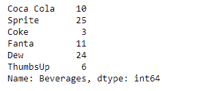
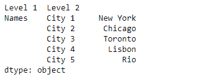
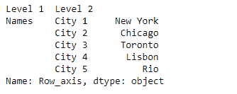

# Python |熊猫系列. rename()

> 原文:[https://www.geeksforgeeks.org/python-pandas-series-rename/](https://www.geeksforgeeks.org/python-pandas-series-rename/)

熊猫系列是带有轴标签的一维数组。标签不必是唯一的，但必须是可散列的类型。该对象支持基于整数和基于标签的索引，并提供了一系列方法来执行涉及索引的操作。

熊猫 `**Series.rename()**`功能用于改变给定系列对象的系列索引标签或名称。

> **语法:** Series.rename(index=None，**kwargs)
> 
> **参数:**
> **索引:**类似字典的 or 函数是要应用于索引的转换
> **复制:**也是复制底层数据
> **在原地:**是否返回新的 Series。如果为真，则忽略副本的值。
> **级别:**如果是多索引，只重命名指定级别的标签。
> 
> **返回:**序列、数据帧或无

**示例#1:** 使用`Series.rename()`函数重命名给定系列对象的名称。

```py
# importing pandas as pd
import pandas as pd

# Creating the Series
sr = pd.Series([10, 25, 3, 11, 24, 6])

# Create the Index
index_ = ['Coca Cola', 'Sprite', 'Coke', 'Fanta', 'Dew', 'ThumbsUp']

# set the index
sr.index = index_

# Print the series
print(sr)
```

**输出:**


现在我们将使用`Series.rename()`函数来重命名给定系列对象的名称。

```py
# rename the series
result = sr.rename('Beverages')

# Print the result
print(result)
```

**输出:**


正如我们在输出中看到的，`Series.rename()`函数已经成功地重命名了给定的序列对象。

**示例#2:** 使用`Series.rename()`函数重命名给定序列对象的多索引轴。

```py
# importing pandas as pd
import pandas as pd

# Creating the Series
sr = pd.Series(['New York', 'Chicago', 'Toronto', 'Lisbon', 'Rio'])

# Create the MultiIndex
index_ = pd.MultiIndex.from_product([['Names'], ['City 1', 'City 2', 'City 3', 'City 4', 'City 5']],
                                                                      names =['Level 1', 'Level 2'])

# set the index
sr.index = index_

# Print the series
print(sr)
```

**输出:**



现在我们将使用`Series.rename()`函数来重命名给定系列对象的第 0 级。

```py
# rename the 0th level
result = sr.rename(level = 0, index = 'Row_axis')

# Print the result
print(result)
```

**输出:**



正如我们在输出中看到的，`Series.rename()`函数已经成功地重命名了给定系列对象的第 0 级。