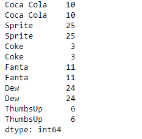
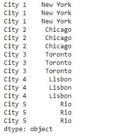

# 蟒蛇|熊猫系列. repeat()

> 原文:[https://www.geeksforgeeks.org/python-pandas-series-repeat/](https://www.geeksforgeeks.org/python-pandas-series-repeat/)

熊猫系列是带有轴标签的一维数组。标签不必是唯一的，但必须是可散列的类型。该对象支持基于整数和基于标签的索引，并提供了一系列方法来执行涉及索引的操作。

熊猫 `**Series.repeat()**`功能重复一个系列的元素。它返回一个新的序列，其中当前序列的每个元素被连续重复给定的次数。

> **语法:**系列。重复(重复，轴=无)
> 
> **参数:**
> **重复次数:**每个元素的重复次数。
> **轴:**无
> 
> **返回:**重复 _ 系列

**示例#1:** 使用`Series.repeat()`功能重复给定序列对象中的每个值 2 次。

```
# importing pandas as pd
import pandas as pd

# Creating the Series
sr = pd.Series([10, 25, 3, 11, 24, 6])

# Create the Index
index_ = ['Coca Cola', 'Sprite', 'Coke', 'Fanta', 'Dew', 'ThumbsUp']

# set the index
sr.index = index_

# Print the series
print(sr)
```

**输出:**


现在我们将使用`Series.repeat()`函数重复给定序列对象的每个值 2 次。

```
# repeat twice
result = sr.repeat(repeats = 2)

# Print the result
print(result)
```

**输出:**


正如我们在输出中看到的那样，`Series.repeat()`函数返回了一个新的序列对象，其中每个值被重复指定的次数。

**示例 2 :** 使用`Series.repeat()`函数在给定的 Series 对象中重复每个值 3 次。

```
# importing pandas as pd
import pandas as pd

# Creating the Series
sr = pd.Series(['New York', 'Chicago', 'Toronto', 'Lisbon', 'Rio'])

# Create the Index
index_ = ['City 1', 'City 2', 'City 3', 'City 4', 'City 5'] 

# set the index
sr.index = index_

# Print the series
print(sr)
```

**输出:**


现在我们将使用`Series.repeat()`函数重复给定序列对象的每个值 3 次。

```
# repeat twice
result = sr.repeat(repeats = 3)

# Print the result
print(result)
```

**输出:**

正如我们在输出中看到的，`Series.repeat()`函数返回了一个新的序列对象，其中每个值被重复指定的次数。