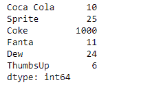
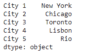
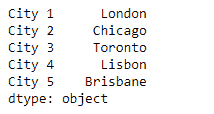

# 蟒蛇|熊猫系列. replace()

> 原文:[https://www.geeksforgeeks.org/python-pandas-series-replace/](https://www.geeksforgeeks.org/python-pandas-series-replace/)

熊猫系列是带有轴标签的一维数组。标签不必是唯一的，但必须是可散列的类型。该对象支持基于整数和基于标签的索引，并提供了一系列方法来执行涉及索引的操作。

Pandas `**Series.replace()**`函数用于将 to_replace 中给出的值替换为值。序列的值会被其他值动态替换。

> **语法:**series . replace(to _ replace = None，value=None，inplace=False，limit=None，regex=False，method='pad ')
> 
> **参数:**
> **to_replace :** 如何找到将要被替换的值。
> **值:**值替换任何与 to_replace 匹配的值。
> **就位:**如果为真，就位。
> **限制:**向前或向后填充的最大尺寸间隙。
> **正则表达式:**是否将 to_replace 和/或 value 解释为正则表达式
> **方法:**当进行替换时使用的方法，当 to_replace 为标量、列表或元组且值为 None 时。
> 
> **替换后返回:**对象。

**示例#1:** 使用`Series.replace()`函数替换给定序列对象中的一些值。

```py
# importing pandas as pd
import pandas as pd

# Creating the Series
sr = pd.Series([10, 25, 3, 11, 24, 6])

# Create the Index
index_ = ['Coca Cola', 'Sprite', 'Coke', 'Fanta', 'Dew', 'ThumbsUp']

# set the index
sr.index = index_

# Print the series
print(sr)
```

**输出:**


现在我们将使用`Series.replace()`函数用新值替换旧值。

```py
# replace 3 by 1000
result = sr.replace(to_replace = 3, value = 1000)

# Print the result
print(result)
```

**输出:**


正如我们在输出中看到的，`Series.replace()`函数已经成功地用新值替换了旧值。

**示例 2 :** 使用`Series.replace()`函数替换给定序列对象中的一些值。

```py
# importing pandas as pd
import pandas as pd

# Creating the Series
sr = pd.Series(['New York', 'Chicago', 'Toronto', 'Lisbon', 'Rio'])

# Create the Index
index_ = ['City 1', 'City 2', 'City 3', 'City 4', 'City 5'] 

# set the index
sr.index = index_

# Print the series
print(sr)
```

**输出:**



现在我们将使用`Series.replace()`函数，使用列表用新值替换旧值。

```py
# replace the old ones in the list with 
# the new values
result = sr.replace(to_replace = ['New York', 'Rio'], value = ['London', 'Brisbane'])

# Print the result
print(result)
```

**输出:**

正如我们在输出中所看到的，`Series.replace()`函数已经使用列表成功地用新值替换了旧值。