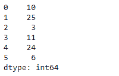

# Python | Pandas series . reset _ index()

> 原文:[https://www . geesforgeks . org/python-pandas-series-reset _ index/](https://www.geeksforgeeks.org/python-pandas-series-reset_index/)

熊猫系列是带有轴标签的一维数组。标签不必是唯一的，但必须是可散列的类型。该对象支持基于整数和基于标签的索引，并提供了一系列方法来执行涉及索引的操作。

熊猫 `**Series.reset_index()**`功能生成一个新的数据帧或系列，并重置索引。当需要将索引用作列时，这很方便。

> **语法:**series . reset _ index(level = None，drop=False，name=None，inplace=False)
> 
> **参数:**
> **级别:**对于具有多索引的系列
> **删除:**只需重置索引，而不将其作为列插入新的数据框中。
> **名称:**包含原始系列值的列的名称。
> **在位:**在位修改系列
> 
> **返回:**结果:系列

**示例#1:** 使用`Series.reset_index()`功能重置给定序列对象的索引。

```
# importing pandas as pd
import pandas as pd

# Creating the Series
sr = pd.Series([10, 25, 3, 11, 24, 6])

# Create the Index
index_ = ['Coca Cola', 'Sprite', 'Coke', 'Fanta', 'Dew', 'ThumbsUp']

# set the index
sr.index = index_

# Print the series
print(sr)
```

**输出:**


现在我们将使用`Series.reset_index()`功能重置给定序列对象的索引。

```
# reset the index
result = sr.reset_index()

# Print the result
print(result)
```

**输出:**

正如我们在输出中看到的，`Series.reset_index()`功能已经将给定 Series 对象的索引重置为默认值。它保留了索引，并将其转换为一列。

**示例 2:** 使用`Series.reset_index()`功能重置给定 Series 对象的索引。不要保留给定序列对象的原始索引标签。

```
# importing pandas as pd
import pandas as pd

# Creating the Series
sr = pd.Series([10, 25, 3, 11, 24, 6])

# Create the Index
index_ = ['Coca Cola', 'Sprite', 'Coke', 'Fanta', 'Dew', 'ThumbsUp']

# set the index
sr.index = index_

# Print the series
print(sr)
```

**输出:**


现在我们将使用`Series.reset_index()`函数来重置给定序列对象的索引，并且我们将删除原始索引标签。

```
# reset the index
result = sr.reset_index(drop = True)

# Print the result
print(result)
```

**输出:**

正如我们在输出中看到的，`Series.reset_index()`功能已经将给定 Series 对象的索引重置为默认值。它已经放弃了原来的索引。