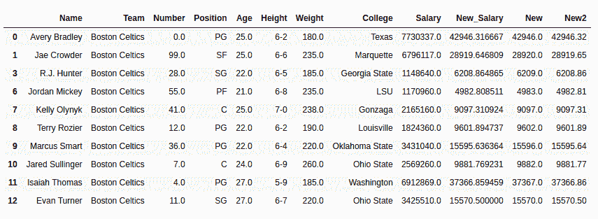

# 蟒蛇|熊猫系列. round()

> 原文:[https://www.geeksforgeeks.org/python-pandas-series-round/](https://www.geeksforgeeks.org/python-pandas-series-round/)

Python 是进行数据分析的优秀语言，主要是因为以数据为中心的 Python 包的奇妙生态系统。 ***【熊猫】*** 就是其中一个包，让导入和分析数据变得容易多了。
在对数列进行数学运算时，很多时候返回的数列是有小数值的，小数值可以达到很多位。Pandas **Series.round()** 方法在这种情况下仅用于对系列中的十进制值进行舍入。

> **语法:** Series.round(decimals=0，*args，* * * kwargs)
> **参数:**
> **decimals:** Int 值，指定该值应四舍五入到的小数位数，默认值为 0。
> **返回类型:**系列，更新值

要下载下例使用的数据集，点击这里的[。](https://media.geeksforgeeks.org/wp-content/uploads/nba.csv)
在下面的例子中，使用的数据框包含了一些 NBA 球员的数据。任何操作前的数据框图像附在下面。


**示例:**
因为在数据帧中，没有任何十进制值超过 1 位的序列。因此，首先将“薪金”列除以“权重”列，得到一个带有十进制值的序列。因为返回的序列的值的小数位数最多为 6 位。首先，使用 round()方法创建一个新系列，通过将参数 2 传递给 round()方法创建另一个系列 new2，以查看该方法的工作情况。在执行任何操作之前，使用 dropna()方法删除了空行。

## 蟒蛇 3

```py
# importing pandas module
import pandas as pd

# making data frame
data = pd.read_csv("https://media.geeksforgeeks.org/wp-content/uploads/nba.csv")

# removing null values to avoid errors
data.dropna(inplace = True)

# creating new column with divided values
data["New_Salary"]= data["Salary"].div(data['Weight'])

# rounding of values and storing in new column
data['New']= data['New_Salary'].round()

# variable for max decimal places
dec_places = 2

# rounding of values and storing in new column
data['New2']= data['New_Salary'].round(dec_places)

# display
data.head(10)
```

**输出:**
如输出图像所示，新系列完全四舍五入，没有小数值，新 2 系列仅包含小数点后 2 位。

